# AnchorFormer-VQA: Multi-View Visual Token Optimization for VQA

Hi 👋 — I built this project to explore **vision–language token optimization** for **multi-view visual question answering** (VQA) using the [nuScenes](https://www.nuscenes.org/) dataset.  
The core idea is to efficiently **compress multiple camera views** into a single **visual token**, and use that token to guide a **language model (T5)** to answer scene-level questions.

---

## 🌆 Overview

The system takes multiple synchronized views from an ego-vehicle and a question (e.g. *“How many motorcycles are there?”*) and outputs a short, textual answer.  
It combines **CLIP’s visual backbone** with **anchor-based token selection** and a **lightweight Perceiver-style aggregator**, fused into **T5** for reasoning.

---

## 🚀 Key Features

- **AnchorFormer (Vision Module)**  
  Efficiently selects top informative CLIP tokens via attention-based anchor sampling.

- **Perceiver Resampler**  
  Uses cross-attention and feed-forward residual layers to refine selected anchors.

- **Gated Pooling Attention (GPA)**  
  Performs gated token pooling within each frame, then across multiple views.

- **GeoFormer (Vision + Language Fusion)**  
  Fuses the single visual embedding with T5’s text encoder; the visual token is prepended to text embeddings before decoding.

- **LoRA-enabled fine-tuning**  
  Optional low-rank adaptation on the T5 model for parameter-efficient training.

- **Subset creation utility**  
  Automatically samples 1% or 10% data subsets for rapid experimentation.

---

## 🧠 Architecture (End‑to‑End, Self‑Explanatory)

> The following **Mermaid** block is a complete, end‑to‑end diagram with two zoom‑ins (attention‑based anchor selection and Perceiver Resampler).  
> GitHub renders Mermaid directly. Replace the back‑ticked image paths with your own to label the six views.

```mermaid
flowchart TB
  %% =========================
  %% GLOBAL STYLES / LEGEND
  %% =========================
  classDef img      fill:#f7f7f7,stroke:#bfbfbf,stroke-width:1px,color:#333;
  classDef block    fill:#e8f1ff,stroke:#4c8bf5,stroke-width:1.6px,color:#111;
  classDef tensor   fill:#fff7e6,stroke:#d4a017,stroke-width:1.3px,color:#111;
  classDef process  fill:#ffecec,stroke:#ff6b6b,stroke-width:1.6px,color:#111;
  classDef note     fill:#e9f7ef,stroke:#46a86b,stroke-width:1.3px,color:#111;
  classDef head     fill:#f0f4ff,stroke:#4c8bf5,stroke-width:1.3px,color:#111;
  classDef emph     fill:#fef3c7,stroke:#d97706,stroke-width:1.6px,color:#111;

  %% =========================
  %% 0) INPUTS (T=6 VIEWS)
  %% =========================
  subgraph S0["0️⃣ Multi-View Inputs (T=6) → Transforms (Resize 224×224, ToFloat, Normalize[CLIP])"]
    direction LR
    I1["Front\n`data/multi_frame/.../front.jpg`"]:::img
    I2["Front-Left\n`.../front_left.jpg`"]:::img
    I3["Front-Right\n`.../front_right.jpg`"]:::img
    I4["Back\n`.../back.jpg`"]:::img
    I5["Back-Left\n`.../back_left.jpg`"]:::img
    I6["Back-Right\n`.../back_right.jpg`"]:::img
  end

  %% =========================
  %% 1) CLIP VISION ENCODER
  %% =========================
  subgraph S1["1️⃣ CLIP Vision Encoder (ViT-L/14) — produces tokens + last-layer self-attention"]
    direction TB
    CLIP["CLIP (frozen? `freeze_clip=True`)"]:::block
    TOK["Hidden states Rv (B*T, S, D)\n[CLS, p1, p2, ..., p{S-1}]"]:::tensor
    ATT["Last-layer attention Att (B*T, H, S, S)"]:::tensor
    CLIP --> TOK
    CLIP --> ATT
  end

  %% link inputs to CLIP
  I1 --> CLIP
  I2 --> CLIP
  I3 --> CLIP
  I4 --> CLIP
  I5 --> CLIP
  I6 --> CLIP

  %% =========================
  %% 1b) TOKEN GRID (CONCEPTUAL) — FOR ONE FRAME
  %% =========================
  subgraph S1b["🔎 Token Grid (one frame, conceptual)"]
    direction TB
    GCLS["CLS"]:::emph
    row1["p1   p2   p3   p4   p5   p6   p7"]:::note
    row2["p8   p9   p10  p11  p12  p13  p14"]:::note
    row3["p15  p16  p17  p18  p19  p20  p21"]:::note
    row4["p22  p23  p24  p25  p26  p27  p28"]:::note
    row5["p29  p30  p31  p32  p33  p34  p35"]:::note
    row6["p36  p37  p38  p39  p40  p41  p42"]:::note
    row7["p43  p44  p45  p46  p47  p48  p49"]:::note
  end
  TOK -. "Tokens include CLS + grid of patches" .- S1b

  %% =========================
  %% 2) ATTENTION-BASED ANCHOR SELECTION
  %% =========================
  subgraph S2["2️⃣ Attention‑based Anchor Selection (per frame)"]
    direction TB
    CLS2P["Extract CLS→Patch scores\nAtt[:, :, 0, 1:] → (B*T, H, S-1)"]:::note
    subgraph HEADS["Per-head Top‑k (encourage diversity across heads)"]
      direction LR
      H1["Head 1\nSort CLS→patch\nPick top‑k₁"]:::head
      H2["Head 2\nSort CLS→patch\nPick top‑k₂"]:::head
      H3["Head 3\nSort CLS→patch\nPick top‑k₃"]:::head
      HH["Head H\nSort CLS→patch\nPick top‑k_H"]:::head
    end
    MERGE["Union across heads (dedup indices)"]:::process
    FILL["Global backfill if needed:\nRank by mean over heads → fill until TN"]:::process
    IA["IA = {CLS} ∪ Selected patches\n(B*T, TN+1, D)"]:::tensor
    CLS2P --> HEADS --> MERGE --> FILL --> IA
  end
  ATT --> CLS2P
  TOK --> HEADS

  %% =========================
  %% 2b) VISUALIZE SELECTION ON GRID (CONCEPTUAL OVERLAY)
  %% =========================
  subgraph S2b["🔎 Grid Overlay (conceptual) — showing selections"]
    direction TB
    note1["Example:\nHead‑1 picks {p3, p7, p18, ...}\nHead‑2 picks {p5, p9, p26, ...}\nHead‑3 picks {p1, p24, ...}"]:::note
    union["Union + backfill → TN anchors"]:::process
  end
  S1b -. "CLS→patch heatmaps per head" .- S2b
  HEADS --> S2b
  S2b --> union --> IA

  %% =========================
  %% 3) PERCEIVER RESAMPLER (CROSS‑ATTN REFINEMENT)
  %% =========================
  subgraph S3["3️⃣ PerceiverResampler (depth = 6) — Q=IA, K/V=Rv"]
    direction TB
    Q["Queries = IA (B*T, M=TN+1, D)"]:::tensor
    KV["Keys/Values = Rv (B*T, S, D)"]:::tensor

    L1["Layer 1:\nCross‑Attention (Q=IA, K/V=Rv) + Residual"]:::block
    F1["FeedForward (Pre‑LN) + Residual"]:::block
    L2["Layer 2:\nCross‑Attention + Residual"]:::block
    F2["FeedForward + Residual"]:::block
    L3["Layer 3:\nCross‑Attention + Residual"]:::block
    F3["FeedForward + Residual"]:::block
    LN["Final LayerNorm"]:::block

    OUT_HV["Hv: refined anchors\n(B*T, M, D)"]:::tensor

    Q --> L1 --> F1 --> L2 --> F2 --> L3 --> F3 --> LN --> OUT_HV
    KV --> L1
  end
  IA --> Q
  TOK --> KV

  %% =========================
  %% 4) GPA POOLING (TOKEN→FRAME, FRAME→BATCH)
  %% =========================
  subgraph S4["4️⃣ Gated Pooling Attention (GPA)"]
    direction TB
    GPA1["GPA over anchors (per frame)\n(B*T, 1, D) = weighted sum over M"]:::process
    RSH["Reshape → (B, T, D)"]:::note
    GPA2["GPA over frames (multi‑view)\n(B, 1, D) = weighted sum over T"]:::process
  end
  OUT_HV --> GPA1 --> RSH --> GPA2

  %% =========================
  %% 5) PROJECTION → VISUAL TOKEN
  %% =========================
  subgraph S5["5️⃣ Linear Projection to LM width"]
    direction TB
    PROJ["Linear(D → d_lm)"]:::block
    VTOK["Fused visual token\n(B, 1, d_lm)"]:::tensor
    PROJ --> VTOK
  end
  GPA2 --> PROJ

  %% =========================
  %% 6) T5 FUSION → ANSWER
  %% =========================
  subgraph S6["6️⃣ T5 Fusion + Decoding"]
    direction TB
    TEXT["T5 Encoder (text)\ninput_ids, attention_mask → (B, L, d_lm)"]:::tensor
    CAT["Prepend visual token\n→ (B, L+1, d_lm)\nUpdate mask (B, L+1)"]:::process
    DEC["T5 Decoder"]:::block
    ANS["Answer text"]:::tensor
    TEXT --> CAT --> DEC --> ANS
  end

  VTOK --> CAT

  %% =========================
  %% 7) OPTIONAL: LoRA (if enabled)
  %% =========================
  subgraph S7["7️⃣ Optional: LoRA on T5 (PEFT)"]
    direction TB
    LCONF["Targets: q,k,v,o\nrank=r, alpha, dropout"]:::note
    ADAPT["Train LoRA adapters\n(base weights frozen)"]:::process
    MERGE_LORA["merge_and_unload → single checkpoint"]:::process
    LCONF --> ADAPT --> MERGE_LORA
  end
  S6 -. "Applies if --use-lora" .- S7
```



---

## 📂 Repository Structure

```
├── dataset.py                 # MultiViewDataset class (multi-frame + tokenizer collate)
├── model.py (anchor_former_mvp.py)   # CLIP + AnchorFormer + Perceiver + GPA + GeoFormer(T5)
├── train.py                   # Training script with subset, LoRA, checkpoint, and stats
├── eval.py                    # Evaluation script (generate + EM/F1/BLEU/ROUGE metrics)
├── multi_view_results/        # Auto-created for outputs, logs, and checkpoints
└── data/
    └── multi_frame/
        ├── multi_frame_train.json
        ├── multi_frame_val.json
        └── multi_frame_test.json
```

---

## ⚙️ Installation

```bash
git clone https://github.com/<your-username>/AnchorFormer-VQA.git
cd AnchorFormer-VQA
pip install -r requirements.txt
```

**Minimal requirements:**
```
torch >= 2.0
torchvision >= 0.15
transformers >= 4.30
tqdm
matplotlib
pandas
peft        # for LoRA
```

---

## 🗃️ Dataset Format

Each JSON file (`multi_frame_train.json`, `multi_frame_val.json`, `multi_frame_test.json`) is a list of samples:
```json
[
  [
    {"Q": "How many persons are there?", "A": "3"},
    {
      "front": "path/to/front_cam.jpg",
      "left": "path/to/left_cam.jpg",
      "right": "path/to/right_cam.jpg",
      "rear": "path/to/rear_cam.jpg"
    }
  ]
]
```

Each entry pairs a QA object with multiple synchronized view paths.

---

## 🏋️‍♂️ Training

### Full dataset training
```bash
python train.py   --dataset-dir data/multi_frame   --lm t5-base   --batch-size 2   --epochs 5
```

### Subset training (for quick experiments)
```bash
python train.py   --dataset-dir data/multi_frame   --use-subset subdata_10
```

### LoRA training
```bash
python train.py   --use-lora   --lora-r 16   --lora-alpha 32   --lora-dropout 0.05   --lora-target q k v o
```

### Checkpoint resume
```bash
python train.py   --load-checkpoint   --checkpoint-file 2025-09-12_21-39-57
```

---

## 📊 Outputs

After each run, a directory like `multi_view_results/2025-09-12_21-39-57/` is created containing:

| File | Description |
|------|--------------|
| `latest_model.pth` | Saved best model (merged if LoRA used) |
| `loss.png` | Training vs validation loss plot |
| `stats.json` | Full loss stats & hyperparameters |
| `multi_view_results.csv` | CSV summary |
| `lora_adapter/` | (Optional) LoRA adapter weights |

---

## 🧩 Evaluation

### Run evaluation
```bash
python eval.py   --checkpoint-dir 2025-09-12_21-39-57   --dataset-dir data/multi_frame   --batch-size 2
```

### Outputs
All files are saved under the same checkpoint folder:
- `predictions.json` — generated captions  
- `predictions_with_gt.jsonl` — per-example comparison  
- `per_example_metrics.csv` — spreadsheet-friendly table  
- `metrics.json` and `metrics.csv` — aggregate metrics

### Result metrics
```json
{
  "count": 16817,
  "EM": 0.4869,
  "F1": 0.6355,
  "ROUGE_L_F1": 0.6326
}
```

---

## 🧮 Metrics Implemented

| Metric | Description |
|--------|--------------|
| **EM** | Exact match after normalization |
| **F1** | Token-level overlap harmonic mean |
| **ROUGE-L (F1)** | Longest Common Subsequence–based similarity |

> **Note:** `eval.py` also computes BLEU‑4 internally. If you prefer, you can add it back to the table and the sample metrics block.

---

## 💾 Subset Utility

To create 1% and 10% subsets from full data:
```bash
python train.py --create-subsets --dry-run
```
- Subsets are saved to `data/multi_frame/subsets/subdata_1/` and `subdata_10/`
- Deterministic sampling with `--seed`

---

## 🧠 Model Components

| Module | Role |
|--------|------|
| **MultiViewDataset** | Loads multiple view images + tokenizes Q/A pairs |
| **CLIPVisionModel** | Extracts visual patch tokens |
| **select_anchors_from_cls_attention** | Selects top-attention patches |
| **PerceiverResampler** | Cross-attends anchors with full tokens |
| **GPAPool** | Gated attention pooling within and across frames |
| **GeoFormer (T5)** | Language model that fuses visual and text features |
| **LoRA (optional)** | Parameter-efficient fine-tuning for T5 |

---

## 📈 Logging & Visualization

- All logs are printed in real-time with tqdm progress bars.
- Per-epoch validation loss and previews (predicted vs gold) are displayed.
- Loss curve automatically saved to `loss.png`.

---

## 🧰 Reproducibility Tips

- Use `--seed` (default 13) for deterministic subset creation.
- Always match the **CLIP normalization constants** during eval (`build_img_tf()`).
- Freeze or unfreeze CLIP/T5 weights via `--freeze-lm` and `AnchorFormerConfig.freeze_clip`.

---

## 📜 Citation / Acknowledgment

If you use or adapt this code, please cite or reference it as:

> *“AnchorFormer-VQA: Multi-View Visual Token Optimization for Vision–Language Models.”*  
> Author: **Preetam Chhimpa** (2025)

---

## ✨ Author Notes

This repository represents my exploration of **compute-efficient VLM token fusion** for autonomous-vehicle perception QA tasks.  
It serves both as a research prototype and a learning framework for **vision–language token optimization**.

---

### 🧩 Next Steps

- [ ] Add attention heatmaps (assets) to accompany the anchor-selection zoom-in
- [ ] Extend dataset loader for other multi-camera datasets
- [ ] Support mixed-precision training (AMP)
- [ ] Experiment with T5-Large and ViT-H/14 CLIP models

---

