# GeoFormer — Qualitative Panels

_This report shows random, best, and worst test examples based on token-level F1, with all six nuScenes camera views._

# Random test examples (seed=42)

## Example idx=3648

## **Q:** Question: What is the future state of <c1,CAM_BACK,750.8,541.7>? 

## Answer: Keep going straight-
<!-- **Pred:** `Keep going straight.` -->

<!-- **Gold:** `Keep going straight.` -->

<!-- *Metrics:* ✅ **Exact match** | (EM=1, F1=1.000) -->

<table>
<tr>
<th style='text-align:center;padding:4px;font-size:12px;background:#111;color:#eee'>CAM_FRONT</th>
<th style='text-align:center;padding:4px;font-size:12px;background:#111;color:#eee'>CAM_FRONT_LEFT</th>
<th style='text-align:center;padding:4px;font-size:12px;background:#111;color:#eee'>CAM_FRONT_RIGHT</th>
</tr>
<tr>
<td style='text-align:center;padding:4px;background:#000;'>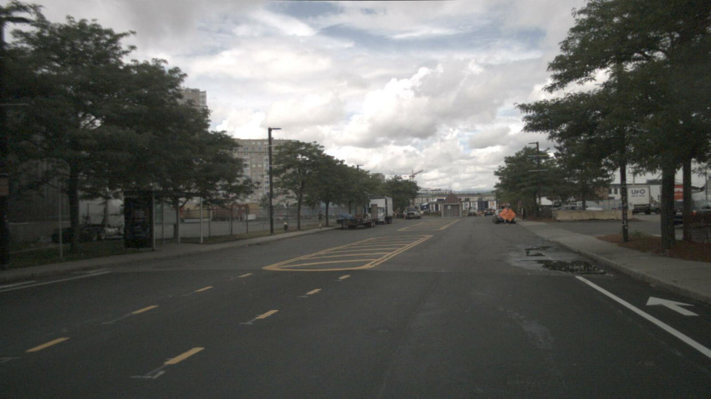</td>
<td style='text-align:center;padding:4px;background:#000;'></td>
<td style='text-align:center;padding:4px;background:#000;'>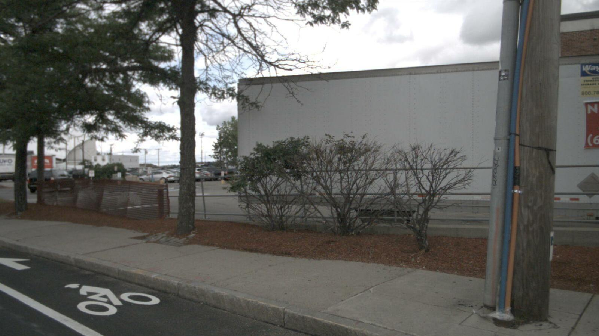</td>
</tr>
<tr>
<th style='text-align:center;padding:4px;font-size:12px;background:#111;color:#eee'>CAM_BACK</th>
<th style='text-align:center;padding:4px;font-size:12px;background:#111;color:#eee'>CAM_BACK_LEFT</th>
<th style='text-align:center;padding:4px;font-size:12px;background:#111;color:#eee'>CAM_BACK_RIGHT</th>
</tr>
<tr>
<td style='text-align:center;padding:4px;background:#000;'>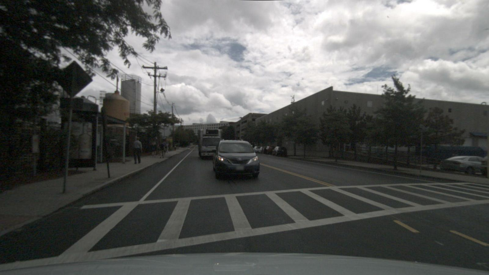</td>
<td style='text-align:center;padding:4px;background:#000;'>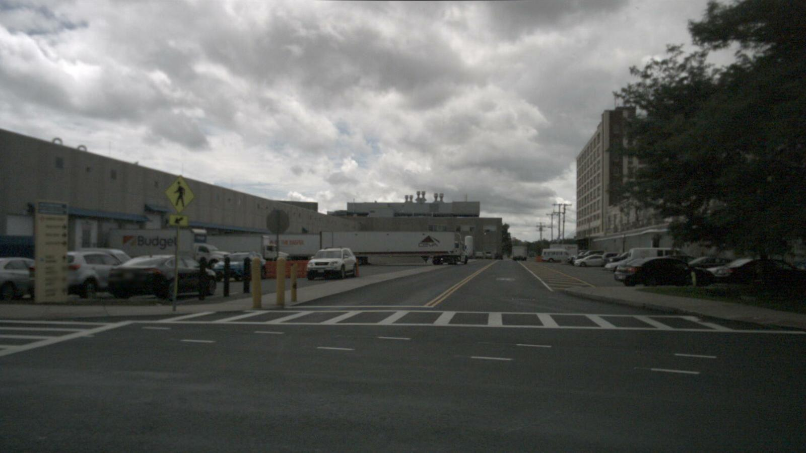</td>
<td style='text-align:center;padding:4px;background:#000;'></td>
</tr>
</table>

---

## Example idx=819

**Q:** Question: Are there barriers to the front of the ego car? Answer:
**Pred:** `Yes.`
**Gold:** `Yes.`

*Metrics:* ✅ **Exact match** | (EM=1, F1=1.000)

<table>
<tr>
<th style='text-align:center;padding:4px;font-size:12px;background:#111;color:#eee'>CAM_FRONT</th>
<th style='text-align:center;padding:4px;font-size:12px;background:#111;color:#eee'>CAM_FRONT_LEFT</th>
<th style='text-align:center;padding:4px;font-size:12px;background:#111;color:#eee'>CAM_FRONT_RIGHT</th>
</tr>
<tr>
<td style='text-align:center;padding:4px;background:#000;'>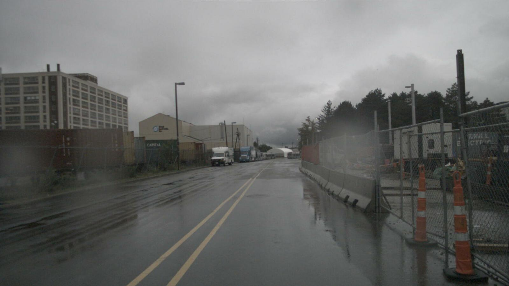</td>
<td style='text-align:center;padding:4px;background:#000;'>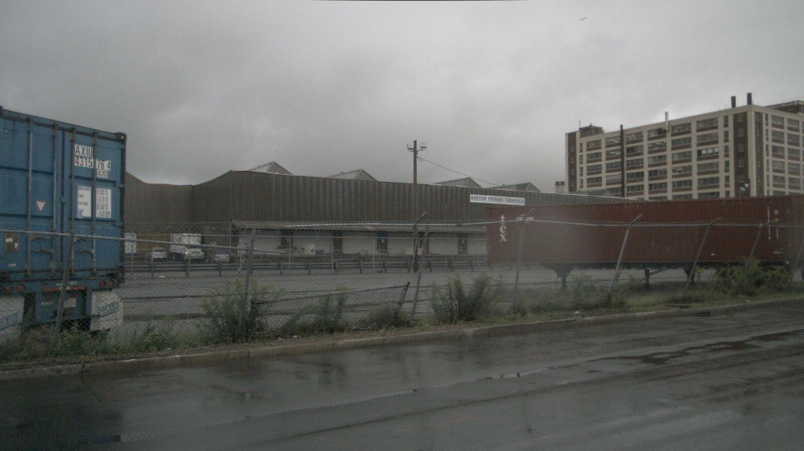</td>
<td style='text-align:center;padding:4px;background:#000;'>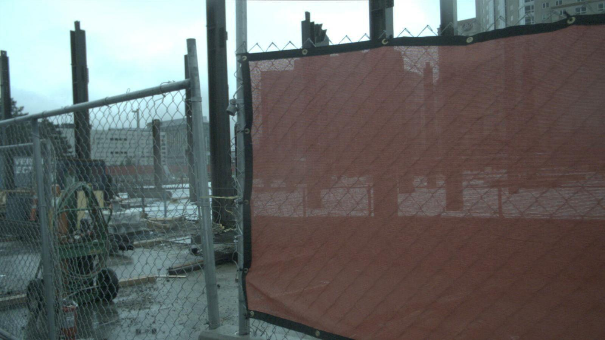</td>
</tr>
<tr>
<th style='text-align:center;padding:4px;font-size:12px;background:#111;color:#eee'>CAM_BACK</th>
<th style='text-align:center;padding:4px;font-size:12px;background:#111;color:#eee'>CAM_BACK_LEFT</th>
<th style='text-align:center;padding:4px;font-size:12px;background:#111;color:#eee'>CAM_BACK_RIGHT</th>
</tr>
<tr>
<td style='text-align:center;padding:4px;background:#000;'>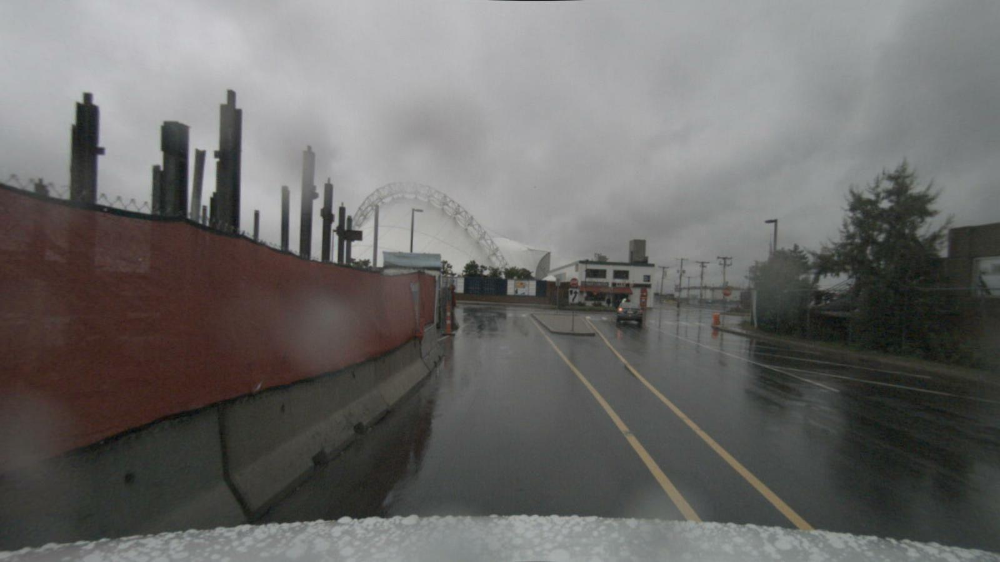</td>
<td style='text-align:center;padding:4px;background:#000;'>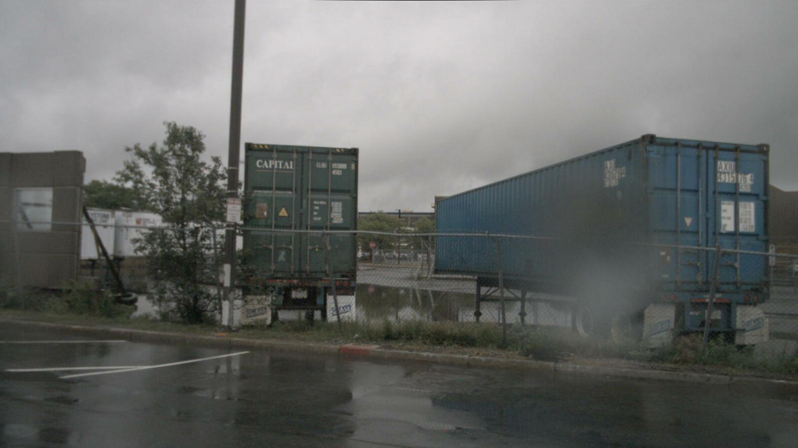</td>
<td style='text-align:center;padding:4px;background:#000;'>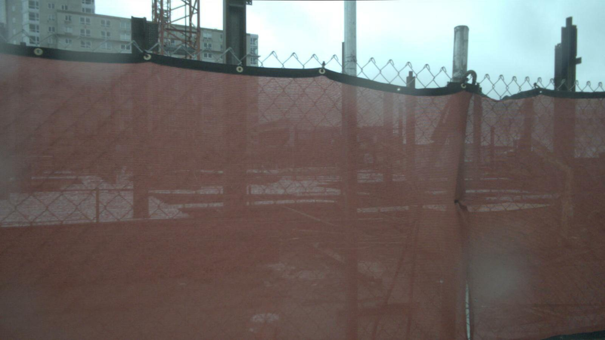</td>
</tr>
</table>

---

## Example idx=9012

**Q:** Question: Which lanes are each important object on in the scene? Answer:
**Pred:** `< c1,CAM_BACK,850.0,500.0> is on the ego lane, < c2,CAM_FRONT,840.0,500.0> is on the ego lane, and < c3,CAM_FRONT,840.0,500.0> is on the left lane.`
**Gold:** `< c2,CAM_BACK,977.5,545.8> is in the ego lane.`

*Metrics:* 🔴 **Low match** | (EM=0, F1=0.286)

<table>
<tr>
<th style='text-align:center;padding:4px;font-size:12px;background:#111;color:#eee'>CAM_FRONT</th>
<th style='text-align:center;padding:4px;font-size:12px;background:#111;color:#eee'>CAM_FRONT_LEFT</th>
<th style='text-align:center;padding:4px;font-size:12px;background:#111;color:#eee'>CAM_FRONT_RIGHT</th>
</tr>
<tr>
<td style='text-align:center;padding:4px;background:#000;'>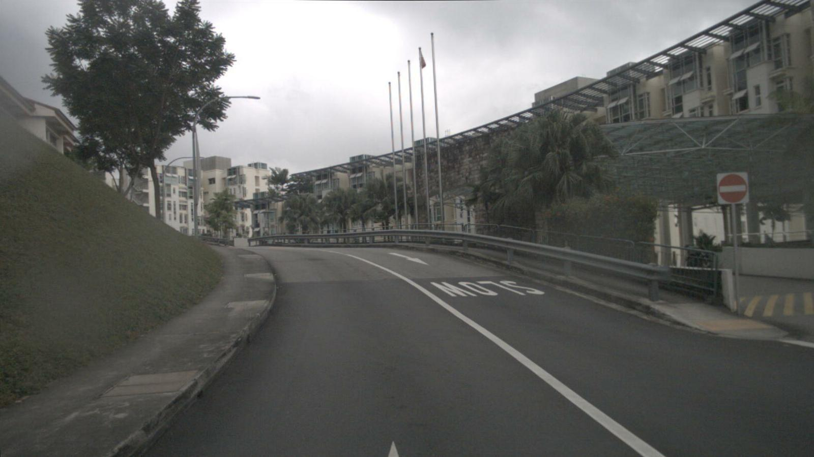</td>
<td style='text-align:center;padding:4px;background:#000;'>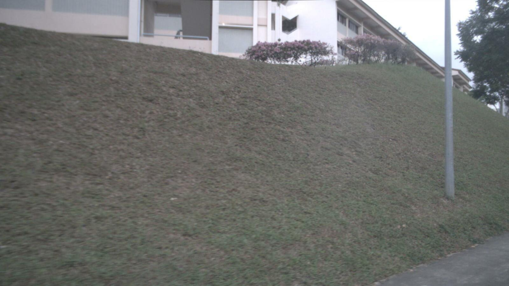</td>
<td style='text-align:center;padding:4px;background:#000;'>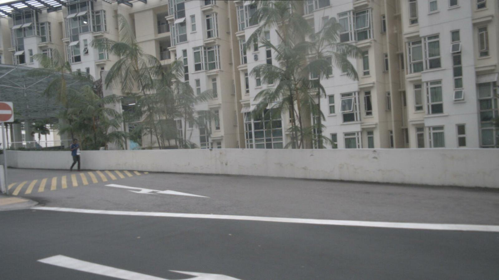</td>
</tr>
<tr>
<th style='text-align:center;padding:4px;font-size:12px;background:#111;color:#eee'>CAM_BACK</th>
<th style='text-align:center;padding:4px;font-size:12px;background:#111;color:#eee'>CAM_BACK_LEFT</th>
<th style='text-align:center;padding:4px;font-size:12px;background:#111;color:#eee'>CAM_BACK_RIGHT</th>
</tr>
<tr>
<td style='text-align:center;padding:4px;background:#000;'>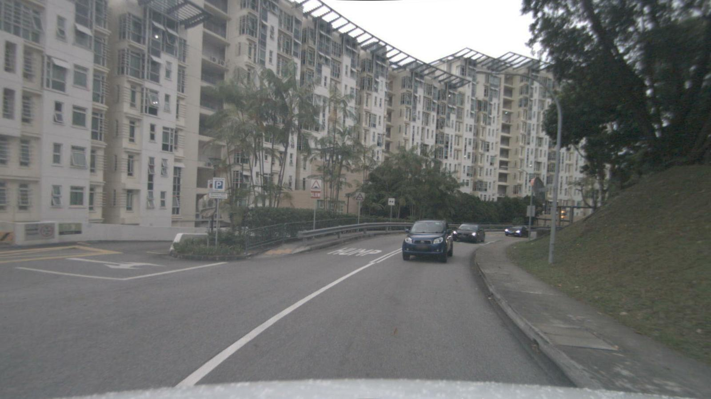</td>
<td style='text-align:center;padding:4px;background:#000;'>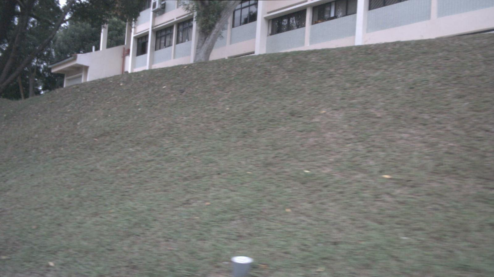</td>
<td style='text-align:center;padding:4px;background:#000;'></td>
</tr>
</table>

---

## Example idx=8024

**Q:** Question: What is the status of the truck that is to the front of the ego car? Answer:
**Pred:** `One truck is parked.`
**Gold:** `The truck in front of the ego car is parked.`

*Metrics:* 🟡 **Partial match** | (EM=0, F1=0.500)

<table>
<tr>
<th style='text-align:center;padding:4px;font-size:12px;background:#111;color:#eee'>CAM_FRONT</th>
<th style='text-align:center;padding:4px;font-size:12px;background:#111;color:#eee'>CAM_FRONT_LEFT</th>
<th style='text-align:center;padding:4px;font-size:12px;background:#111;color:#eee'>CAM_FRONT_RIGHT</th>
</tr>
<tr>
<td style='text-align:center;padding:4px;background:#000;'>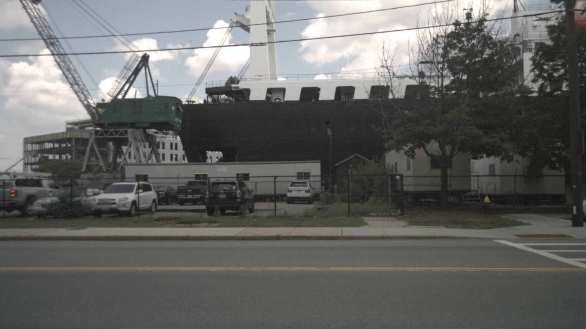</td>
<td style='text-align:center;padding:4px;background:#000;'>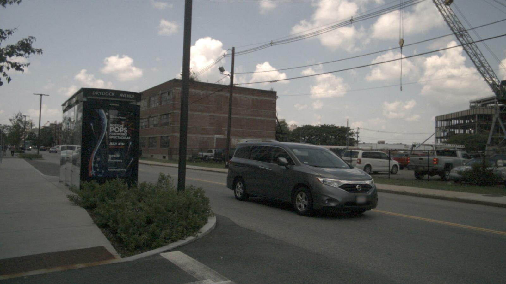</td>
<td style='text-align:center;padding:4px;background:#000;'>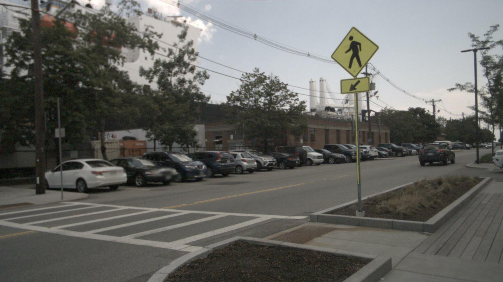</td>
</tr>
<tr>
<th style='text-align:center;padding:4px;font-size:12px;background:#111;color:#eee'>CAM_BACK</th>
<th style='text-align:center;padding:4px;font-size:12px;background:#111;color:#eee'>CAM_BACK_LEFT</th>
<th style='text-align:center;padding:4px;font-size:12px;background:#111;color:#eee'>CAM_BACK_RIGHT</th>
</tr>
<tr>
<td style='text-align:center;padding:4px;background:#000;'>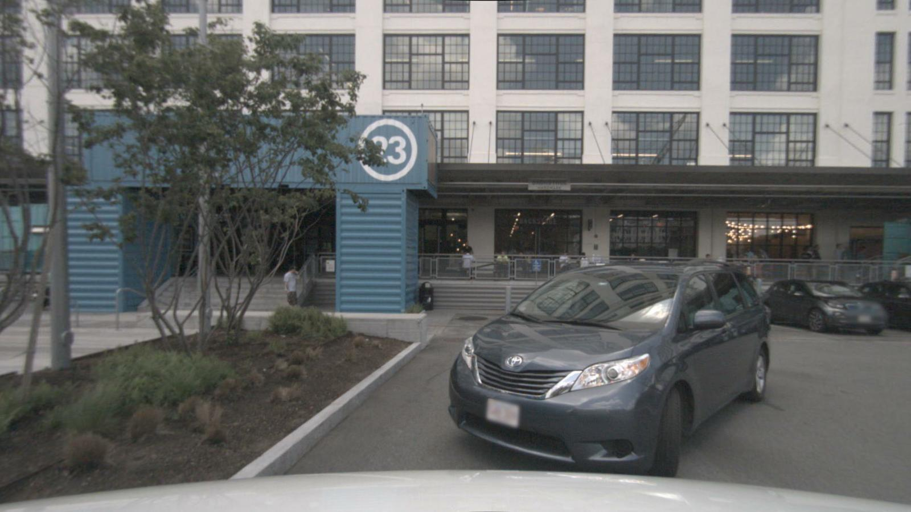</td>
<td style='text-align:center;padding:4px;background:#000;'>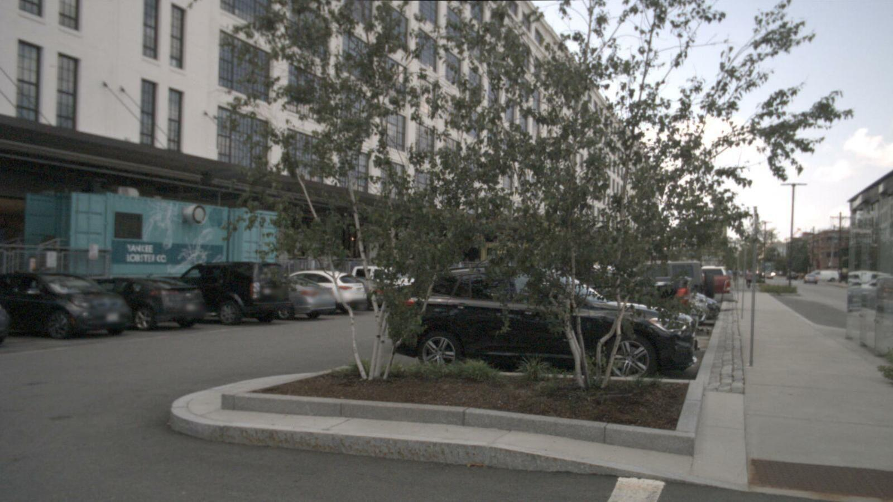</td>
<td style='text-align:center;padding:4px;background:#000;'>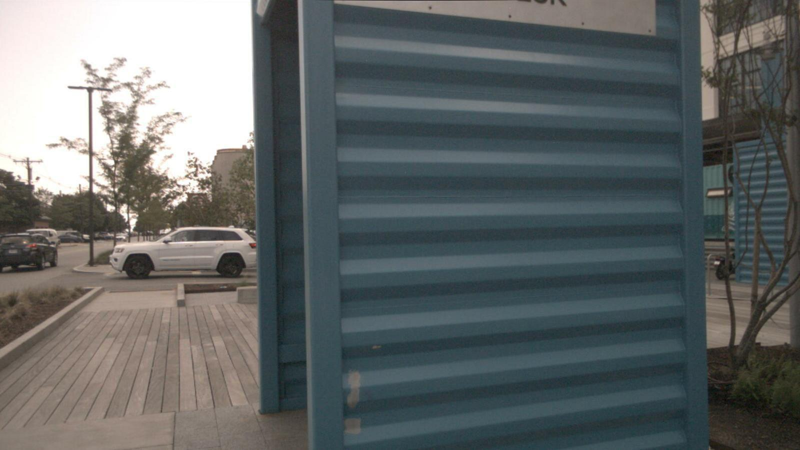</td>
</tr>
</table>

---

## Example idx=7314

**Q:** Question: Based on the observations of <c3,CAM_FRONT,350.8,512.5>, what are possible actions to be taken by <c4,CAM_FRONT,1157.3,521.4>? What is the reason? Answer:
**Pred:** `The action is none, the reason is there is no safety issue.`
**Gold:** `The action is none, the reason is there is no safety issue.`

*Metrics:* ✅ **Exact match** | (EM=1, F1=1.000)

<table>
<tr>
<th style='text-align:center;padding:4px;font-size:12px;background:#111;color:#eee'>CAM_FRONT</th>
<th style='text-align:center;padding:4px;font-size:12px;background:#111;color:#eee'>CAM_FRONT_LEFT</th>
<th style='text-align:center;padding:4px;font-size:12px;background:#111;color:#eee'>CAM_FRONT_RIGHT</th>
</tr>
<tr>
<td style='text-align:center;padding:4px;background:#000;'></td>
<td style='text-align:center;padding:4px;background:#000;'>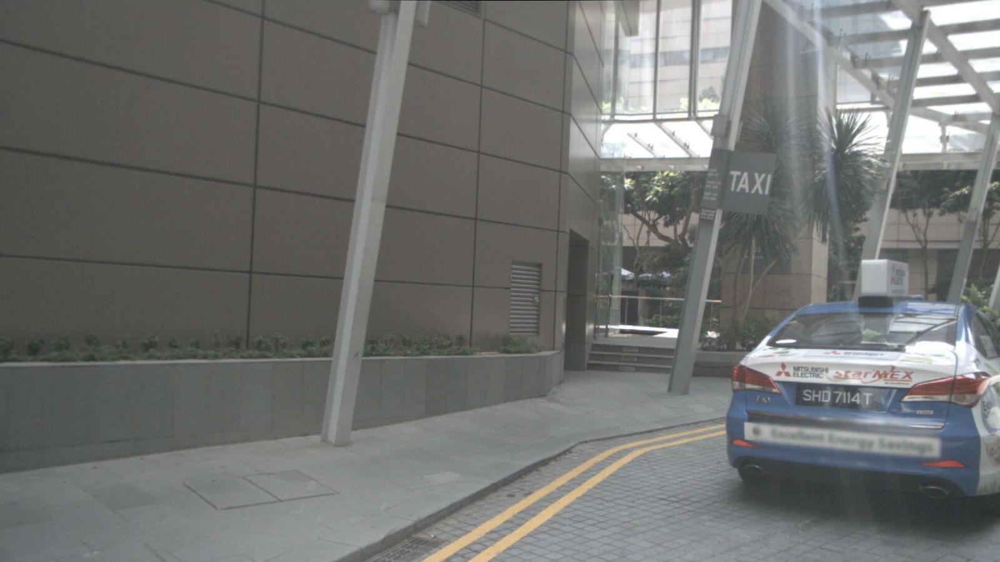</td>
<td style='text-align:center;padding:4px;background:#000;'>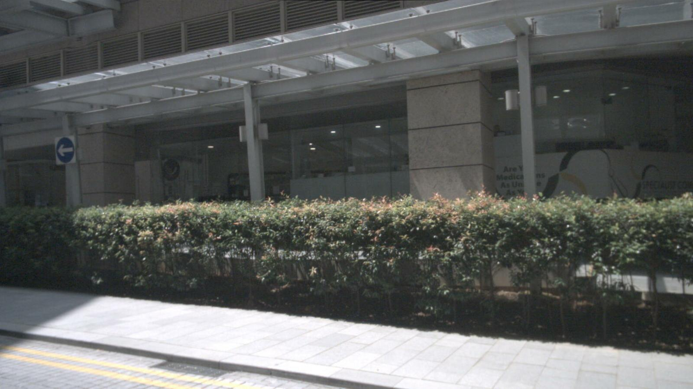</td>
</tr>
<tr>
<th style='text-align:center;padding:4px;font-size:12px;background:#111;color:#eee'>CAM_BACK</th>
<th style='text-align:center;padding:4px;font-size:12px;background:#111;color:#eee'>CAM_BACK_LEFT</th>
<th style='text-align:center;padding:4px;font-size:12px;background:#111;color:#eee'>CAM_BACK_RIGHT</th>
</tr>
<tr>
<td style='text-align:center;padding:4px;background:#000;'>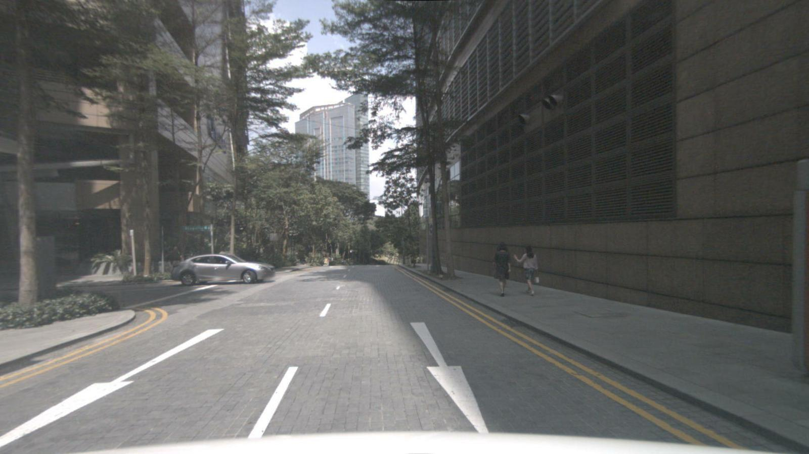</td>
<td style='text-align:center;padding:4px;background:#000;'>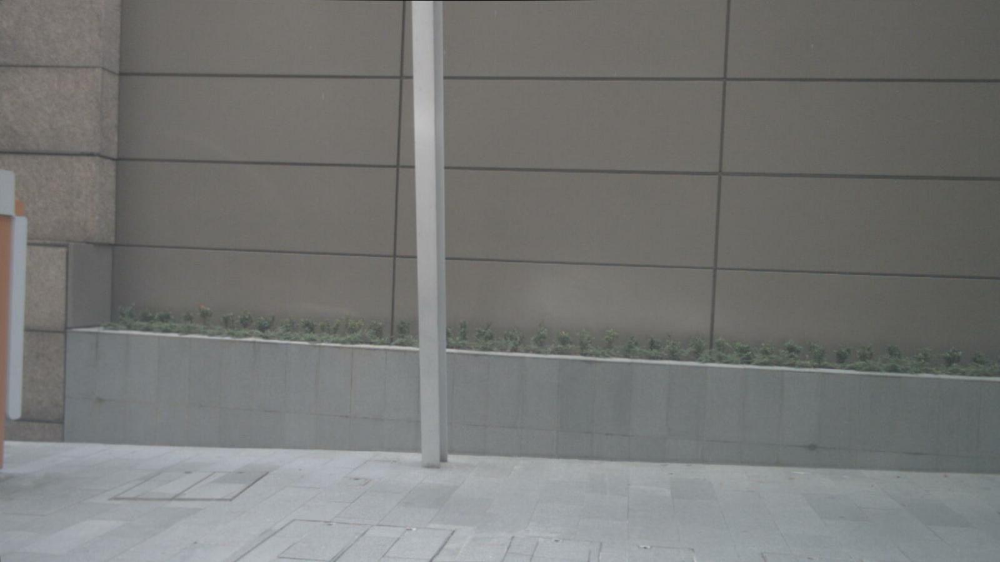</td>
<td style='text-align:center;padding:4px;background:#000;'>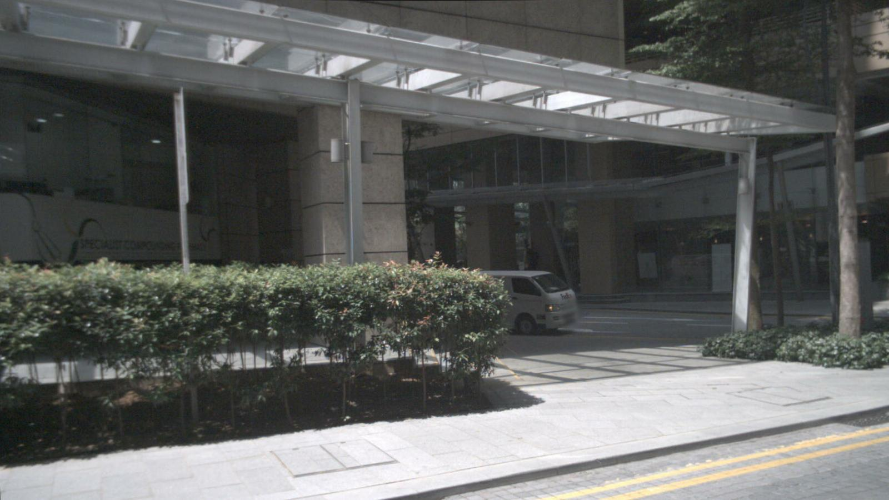</td>
</tr>
</table>

---

## Example idx=4572

**Q:** Question: Are there moving pedestrians to the front of the ego car? Answer:
**Pred:** `Yes.`
**Gold:** `No.`

*Metrics:* 🔴 **Low match** | (EM=0, F1=0.000)

<table>
<tr>
<th style='text-align:center;padding:4px;font-size:12px;background:#111;color:#eee'>CAM_FRONT</th>
<th style='text-align:center;padding:4px;font-size:12px;background:#111;color:#eee'>CAM_FRONT_LEFT</th>
<th style='text-align:center;padding:4px;font-size:12px;background:#111;color:#eee'>CAM_FRONT_RIGHT</th>
</tr>
<tr>
<td style='text-align:center;padding:4px;background:#000;'>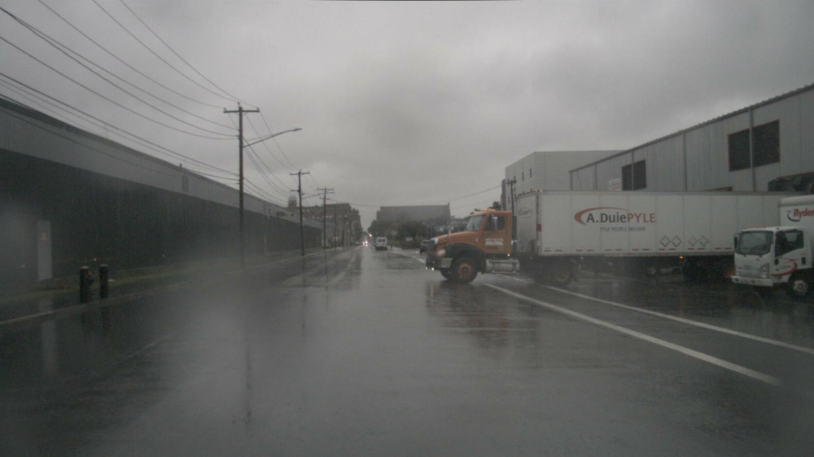</td>
<td style='text-align:center;padding:4px;background:#000;'>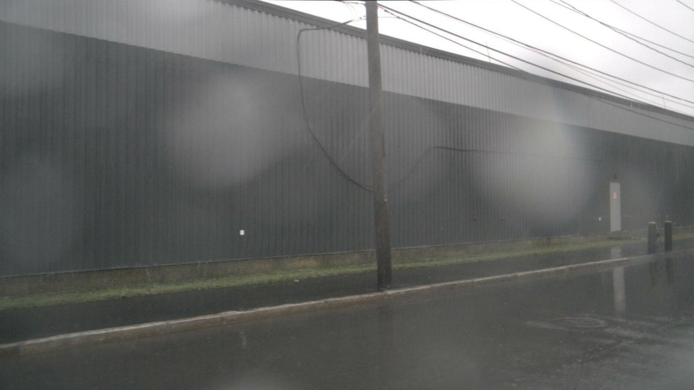</td>
<td style='text-align:center;padding:4px;background:#000;'>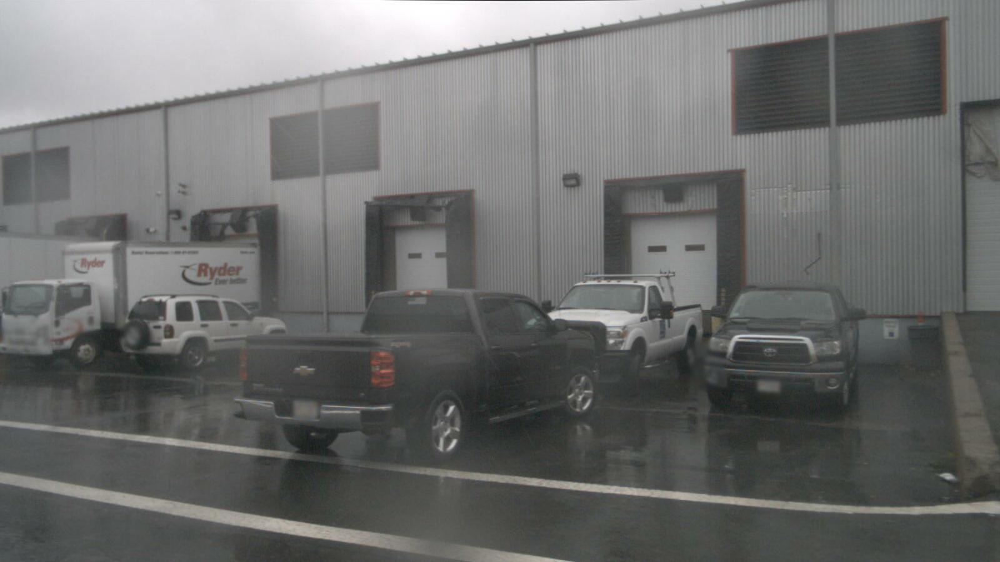</td>
</tr>
<tr>
<th style='text-align:center;padding:4px;font-size:12px;background:#111;color:#eee'>CAM_BACK</th>
<th style='text-align:center;padding:4px;font-size:12px;background:#111;color:#eee'>CAM_BACK_LEFT</th>
<th style='text-align:center;padding:4px;font-size:12px;background:#111;color:#eee'>CAM_BACK_RIGHT</th>
</tr>
<tr>
<td style='text-align:center;padding:4px;background:#000;'>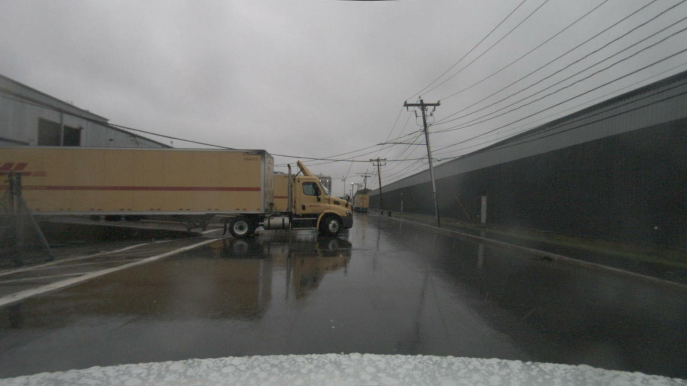</td>
<td style='text-align:center;padding:4px;background:#000;'>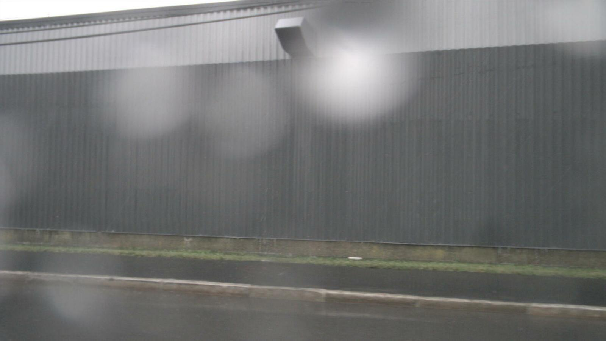</td>
<td style='text-align:center;padding:4px;background:#000;'>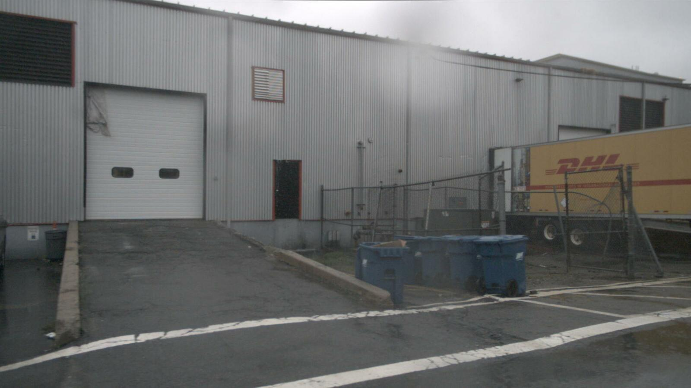</td>
</tr>
</table>

---

## Example idx=3358

**Q:** Question: What is the status of the cars that are to the front left of the ego car? Answer:
**Pred:** `Many cars are parked.`
**Gold:** `Many cars are parked.`

*Metrics:* ✅ **Exact match** | (EM=1, F1=1.000)

<table>
<tr>
<th style='text-align:center;padding:4px;font-size:12px;background:#111;color:#eee'>CAM_FRONT</th>
<th style='text-align:center;padding:4px;font-size:12px;background:#111;color:#eee'>CAM_FRONT_LEFT</th>
<th style='text-align:center;padding:4px;font-size:12px;background:#111;color:#eee'>CAM_FRONT_RIGHT</th>
</tr>
<tr>
<td style='text-align:center;padding:4px;background:#000;'>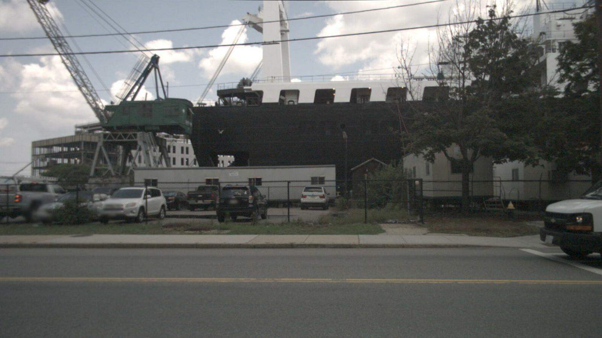</td>
<td style='text-align:center;padding:4px;background:#000;'>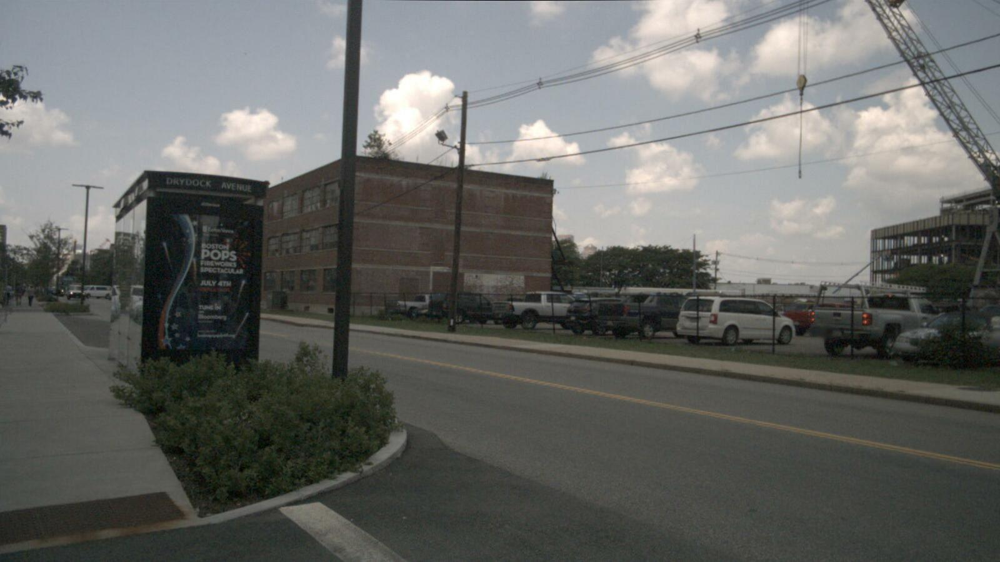</td>
<td style='text-align:center;padding:4px;background:#000;'></td>
</tr>
<tr>
<th style='text-align:center;padding:4px;font-size:12px;background:#111;color:#eee'>CAM_BACK</th>
<th style='text-align:center;padding:4px;font-size:12px;background:#111;color:#eee'>CAM_BACK_LEFT</th>
<th style='text-align:center;padding:4px;font-size:12px;background:#111;color:#eee'>CAM_BACK_RIGHT</th>
</tr>
<tr>
<td style='text-align:center;padding:4px;background:#000;'>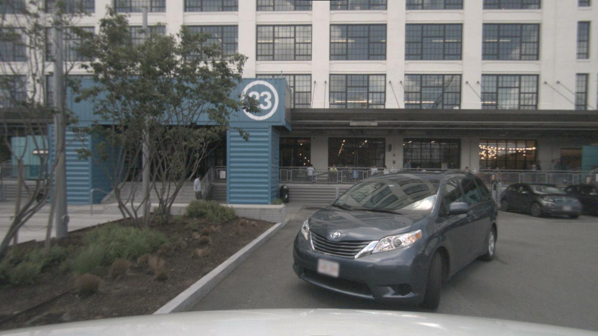</td>
<td style='text-align:center;padding:4px;background:#000;'>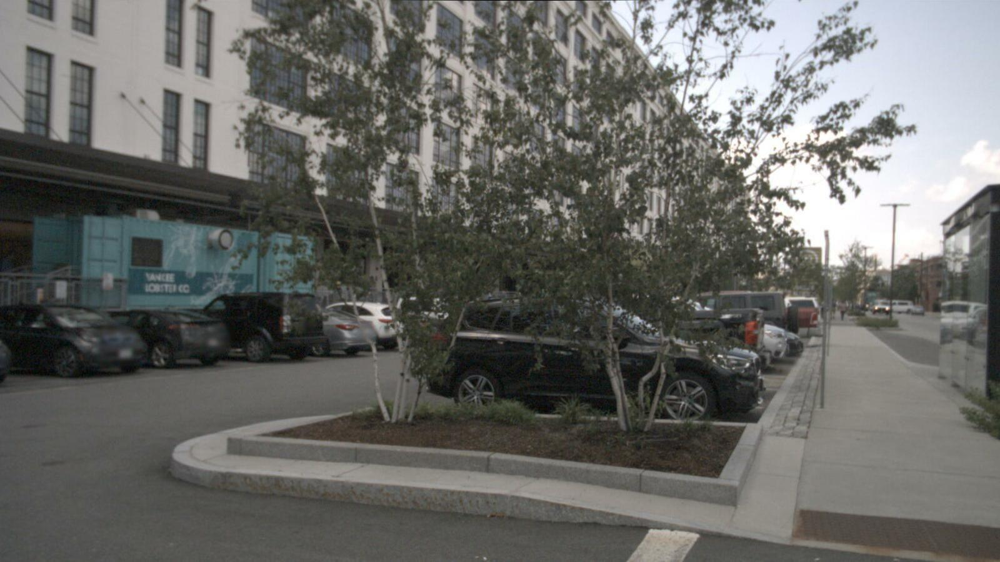</td>
<td style='text-align:center;padding:4px;background:#000;'>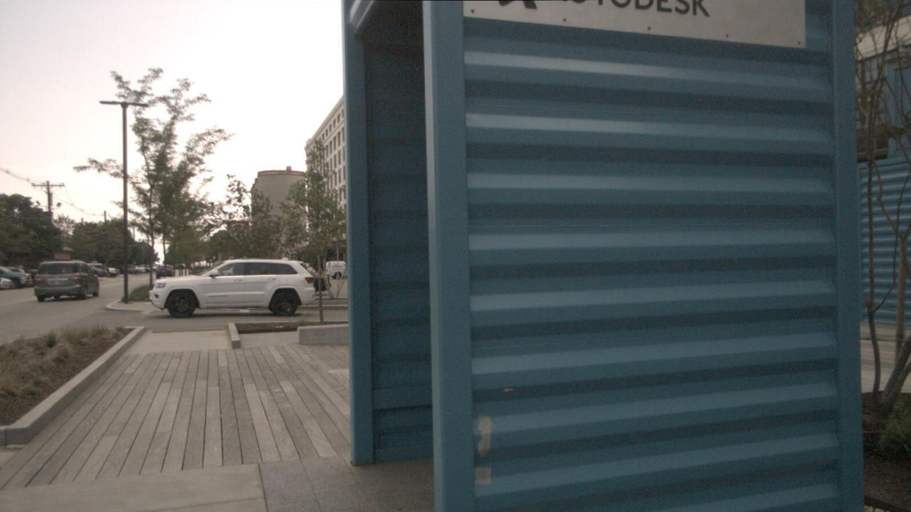</td>
</tr>
</table>

---

## Example idx=2848

**Q:** Question: What is the moving status of object <c1,CAM_BACK_RIGHT,1416.7,522.5>? Answer:
**Pred:** `Going ahead.`
**Gold:** `Turn right.`

*Metrics:* 🔴 **Low match** | (EM=0, F1=0.000)

<table>
<tr>
<th style='text-align:center;padding:4px;font-size:12px;background:#111;color:#eee'>CAM_FRONT</th>
<th style='text-align:center;padding:4px;font-size:12px;background:#111;color:#eee'>CAM_FRONT_LEFT</th>
<th style='text-align:center;padding:4px;font-size:12px;background:#111;color:#eee'>CAM_FRONT_RIGHT</th>
</tr>
<tr>
<td style='text-align:center;padding:4px;background:#000;'>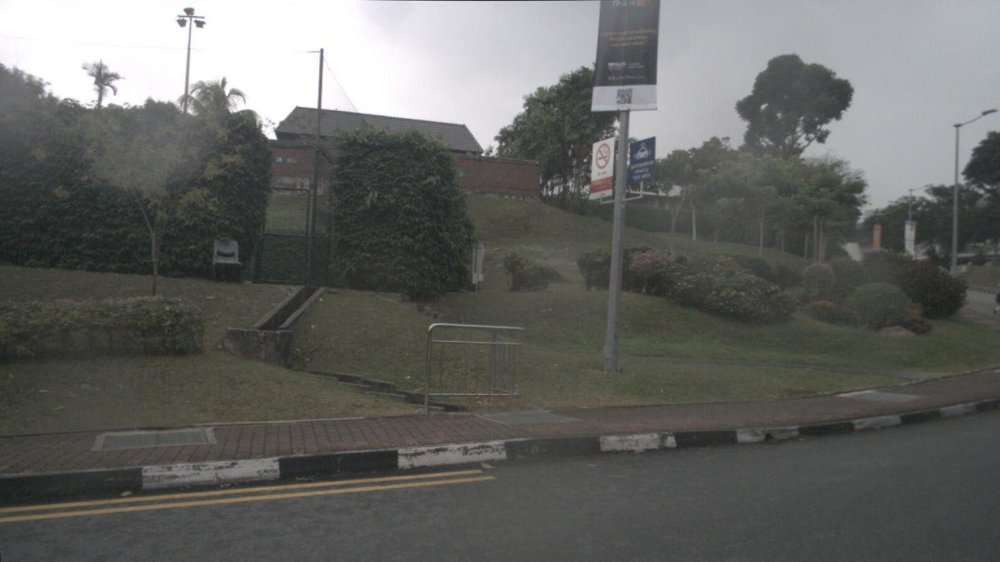</td>
<td style='text-align:center;padding:4px;background:#000;'>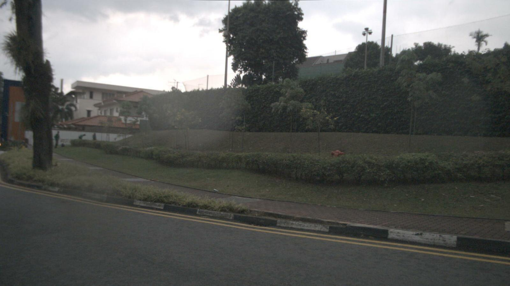</td>
<td style='text-align:center;padding:4px;background:#000;'>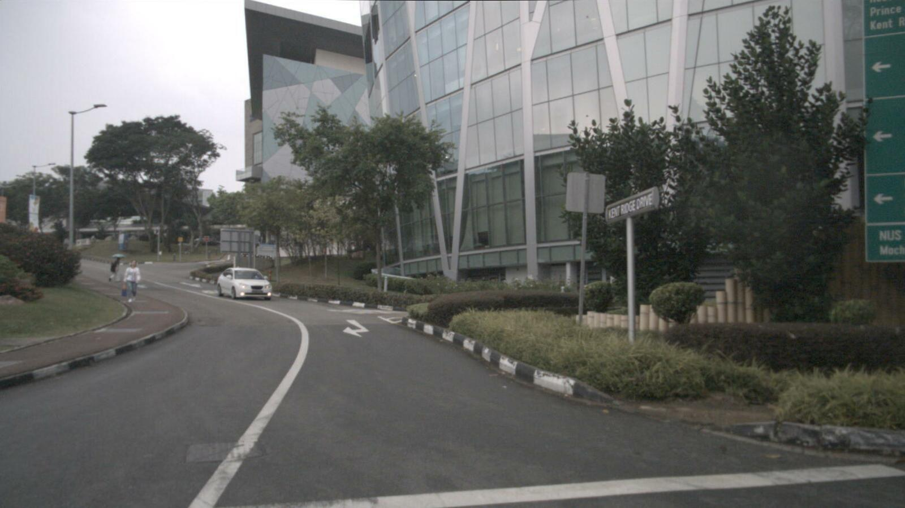</td>
</tr>
<tr>
<th style='text-align:center;padding:4px;font-size:12px;background:#111;color:#eee'>CAM_BACK</th>
<th style='text-align:center;padding:4px;font-size:12px;background:#111;color:#eee'>CAM_BACK_LEFT</th>
<th style='text-align:center;padding:4px;font-size:12px;background:#111;color:#eee'>CAM_BACK_RIGHT</th>
</tr>
<tr>
<td style='text-align:center;padding:4px;background:#000;'>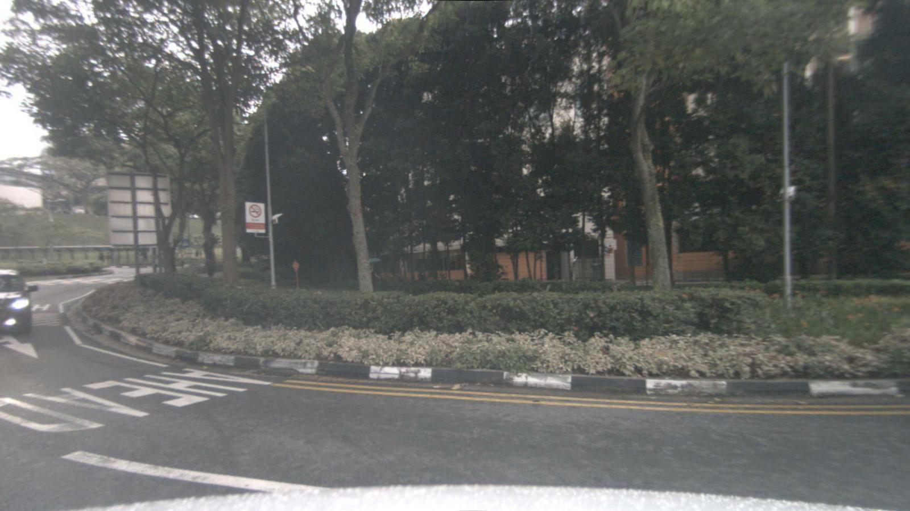</td>
<td style='text-align:center;padding:4px;background:#000;'>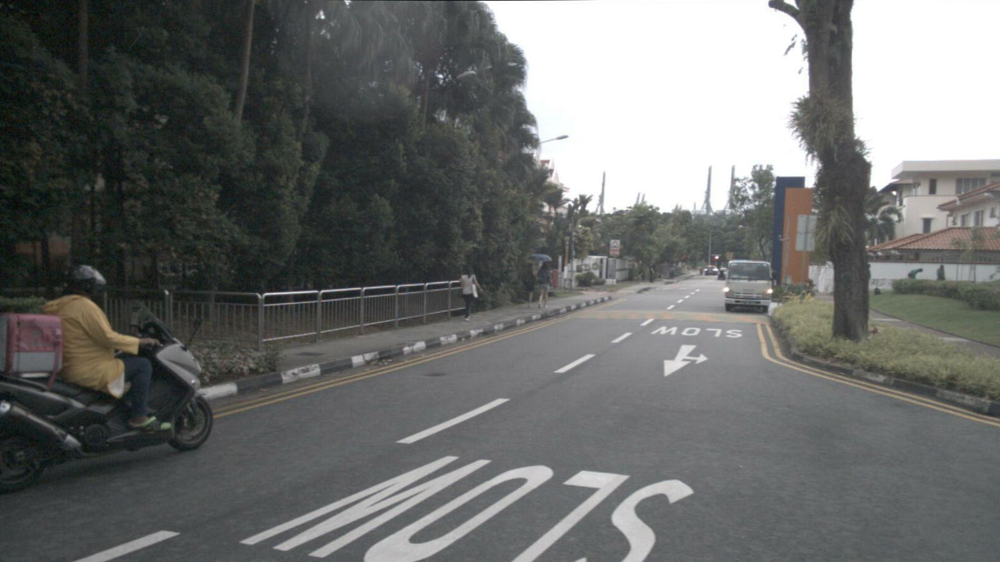</td>
<td style='text-align:center;padding:4px;background:#000;'>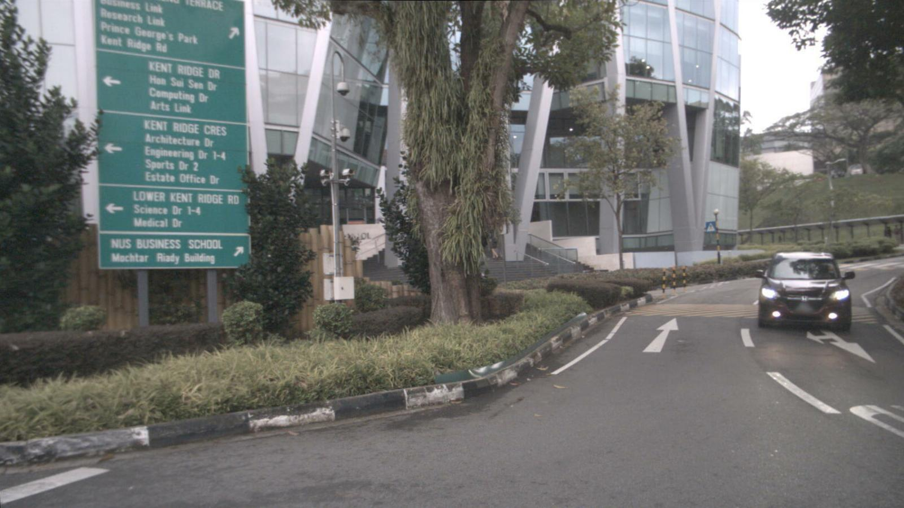</td>
</tr>
</table>

---

## Example idx=13825

**Q:** Question: Is <c2,CAM_BACK,901.7,555.8> an object that the ego vehicle should consider in the current scene? Answer:
**Pred:** `No.`
**Gold:** `No.`

*Metrics:* ✅ **Exact match** | (EM=1, F1=1.000)

<table>
<tr>
<th style='text-align:center;padding:4px;font-size:12px;background:#111;color:#eee'>CAM_FRONT</th>
<th style='text-align:center;padding:4px;font-size:12px;background:#111;color:#eee'>CAM_FRONT_LEFT</th>
<th style='text-align:center;padding:4px;font-size:12px;background:#111;color:#eee'>CAM_FRONT_RIGHT</th>
</tr>
<tr>
<td style='text-align:center;padding:4px;background:#000;'>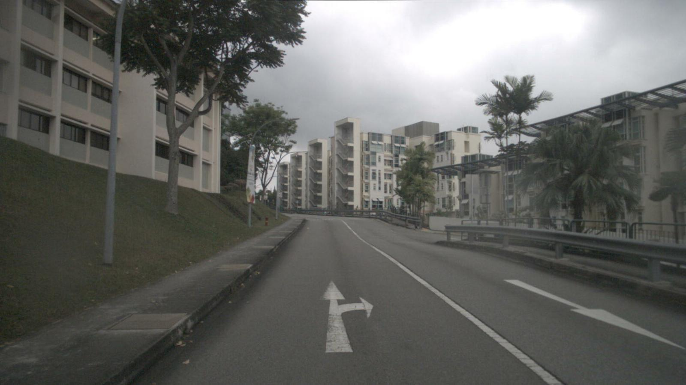</td>
<td style='text-align:center;padding:4px;background:#000;'></td>
<td style='text-align:center;padding:4px;background:#000;'>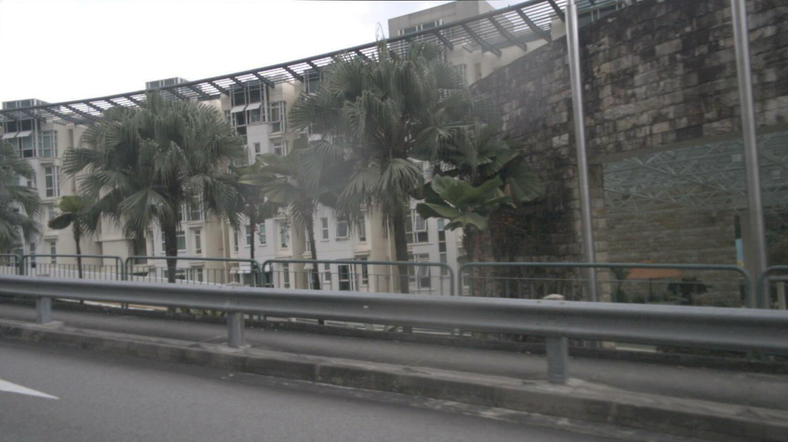</td>
</tr>
<tr>
<th style='text-align:center;padding:4px;font-size:12px;background:#111;color:#eee'>CAM_BACK</th>
<th style='text-align:center;padding:4px;font-size:12px;background:#111;color:#eee'>CAM_BACK_LEFT</th>
<th style='text-align:center;padding:4px;font-size:12px;background:#111;color:#eee'>CAM_BACK_RIGHT</th>
</tr>
<tr>
<td style='text-align:center;padding:4px;background:#000;'></td>
<td style='text-align:center;padding:4px;background:#000;'>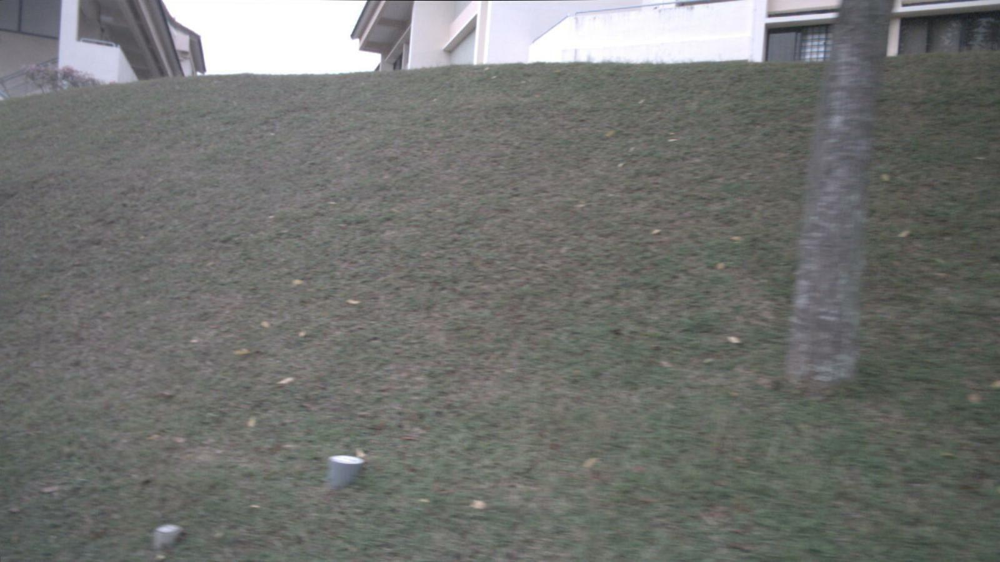</td>
<td style='text-align:center;padding:4px;background:#000;'>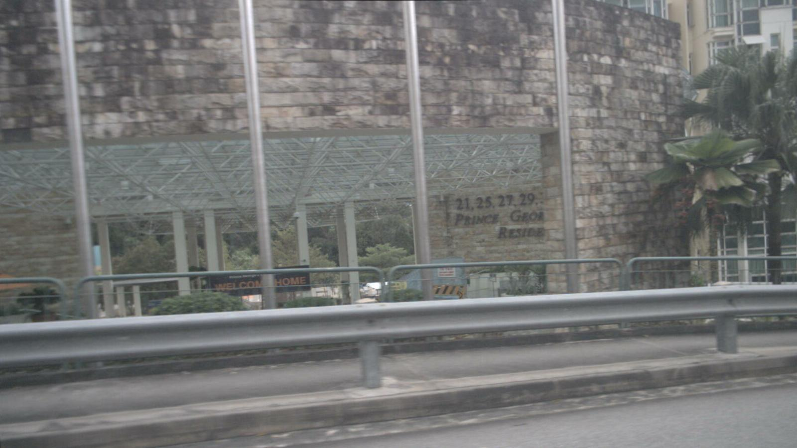</td>
</tr>
</table>

---

## Example idx=1041

**Q:** Question: Are there parked cars to the front right of the ego car? Answer:
**Pred:** `Yes.`
**Gold:** `Yes.`

*Metrics:* ✅ **Exact match** | (EM=1, F1=1.000)

<table>
<tr>
<th style='text-align:center;padding:4px;font-size:12px;background:#111;color:#eee'>CAM_FRONT</th>
<th style='text-align:center;padding:4px;font-size:12px;background:#111;color:#eee'>CAM_FRONT_LEFT</th>
<th style='text-align:center;padding:4px;font-size:12px;background:#111;color:#eee'>CAM_FRONT_RIGHT</th>
</tr>
<tr>
<td style='text-align:center;padding:4px;background:#000;'>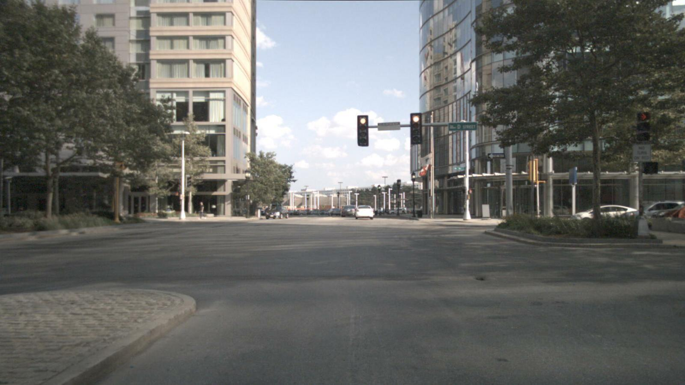</td>
<td style='text-align:center;padding:4px;background:#000;'>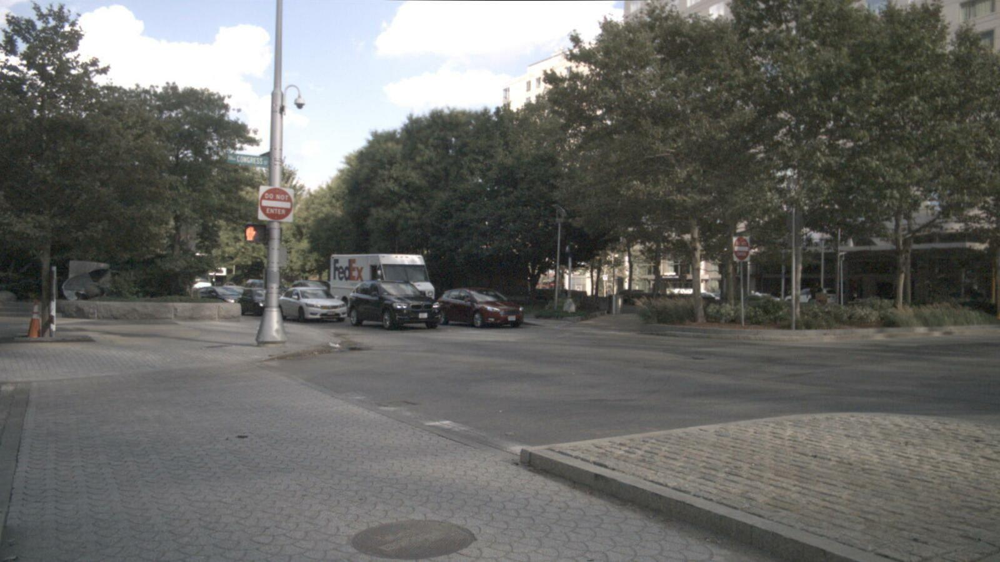</td>
<td style='text-align:center;padding:4px;background:#000;'>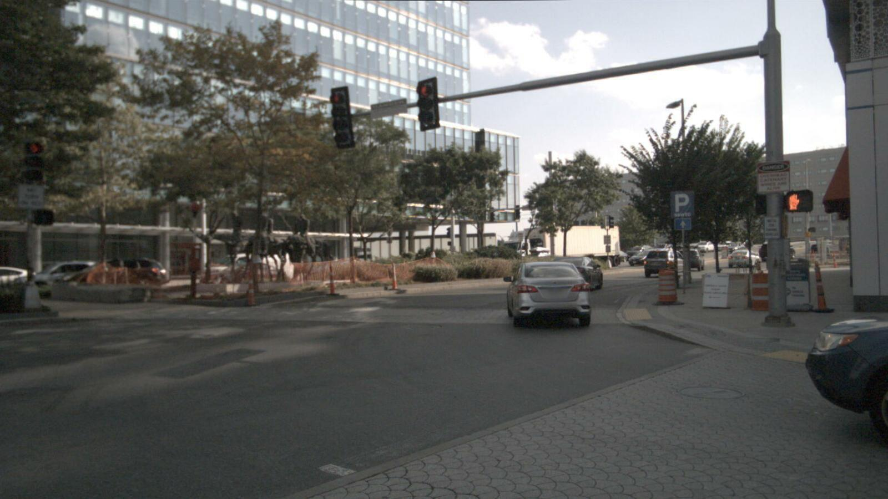</td>
</tr>
<tr>
<th style='text-align:center;padding:4px;font-size:12px;background:#111;color:#eee'>CAM_BACK</th>
<th style='text-align:center;padding:4px;font-size:12px;background:#111;color:#eee'>CAM_BACK_LEFT</th>
<th style='text-align:center;padding:4px;font-size:12px;background:#111;color:#eee'>CAM_BACK_RIGHT</th>
</tr>
<tr>
<td style='text-align:center;padding:4px;background:#000;'>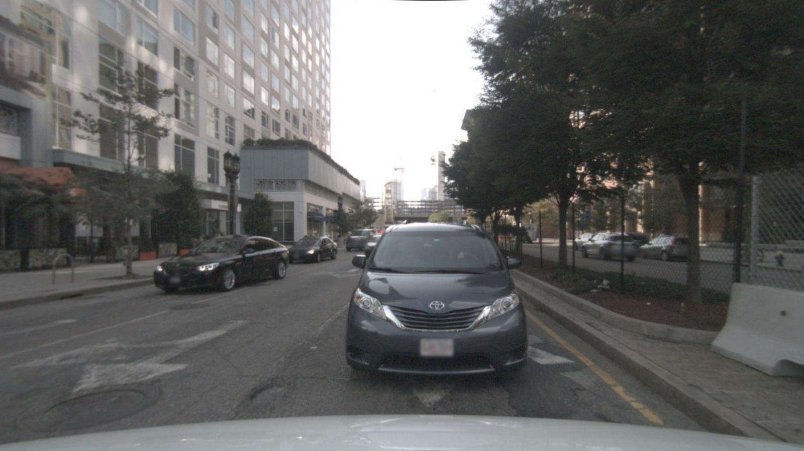</td>
<td style='text-align:center;padding:4px;background:#000;'>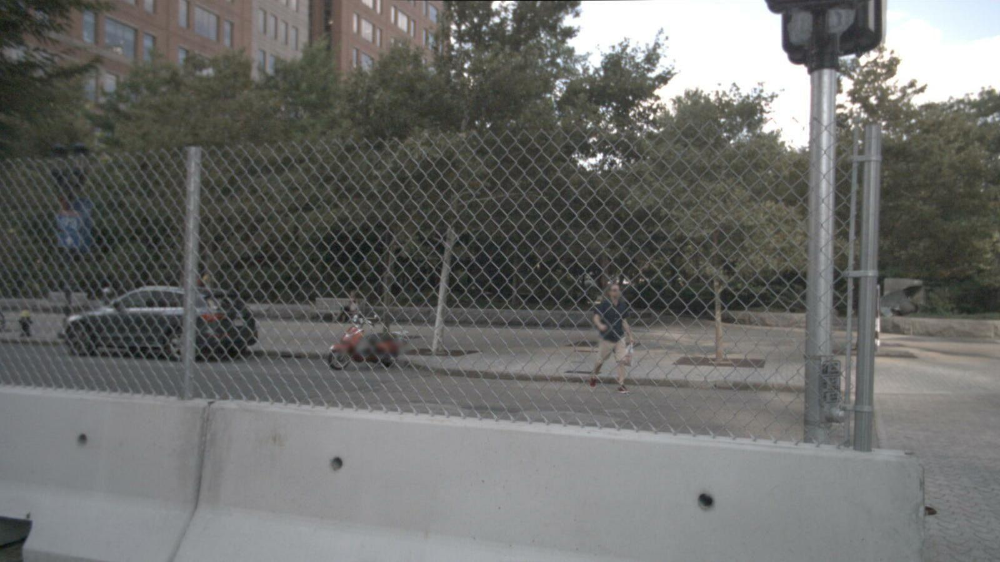</td>
<td style='text-align:center;padding:4px;background:#000;'>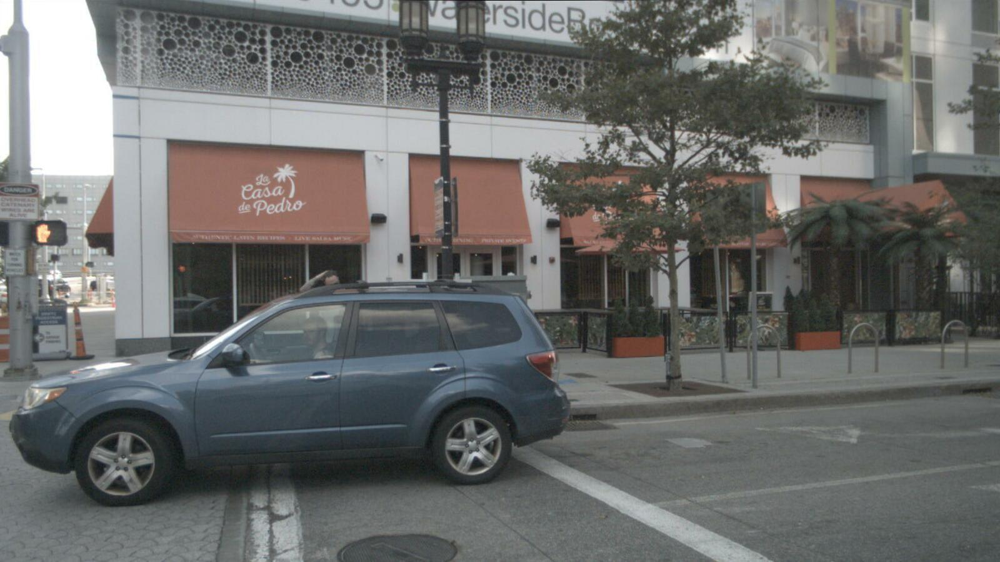</td>
</tr>
</table>

---

# Top 5 examples by F1

## Example idx=16816

**Q:** Question: Except for the ego vehicle, what object would consider <c2,CAM_FRONT,243.3,512.5> to be most relevant to its decision? Answer:
**Pred:** `None.`
**Gold:** `None.`

*Metrics:* ✅ **Exact match** | (EM=1, F1=1.000)

<table>
<tr>
<th style='text-align:center;padding:4px;font-size:12px;background:#111;color:#eee'>CAM_FRONT</th>
<th style='text-align:center;padding:4px;font-size:12px;background:#111;color:#eee'>CAM_FRONT_LEFT</th>
<th style='text-align:center;padding:4px;font-size:12px;background:#111;color:#eee'>CAM_FRONT_RIGHT</th>
</tr>
<tr>
<td style='text-align:center;padding:4px;background:#000;'>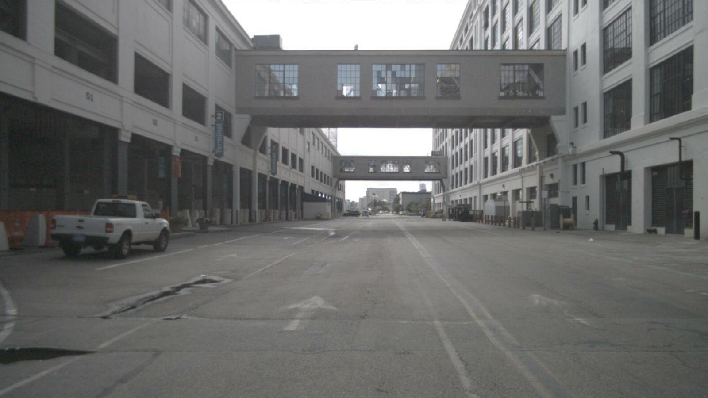</td>
<td style='text-align:center;padding:4px;background:#000;'>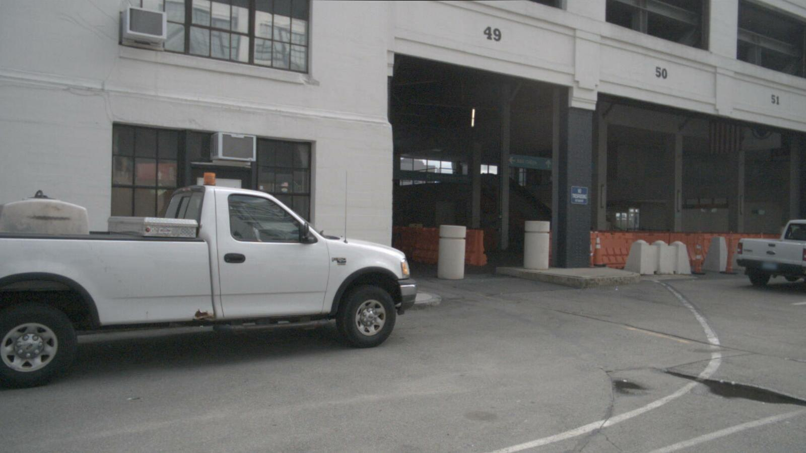</td>
<td style='text-align:center;padding:4px;background:#000;'>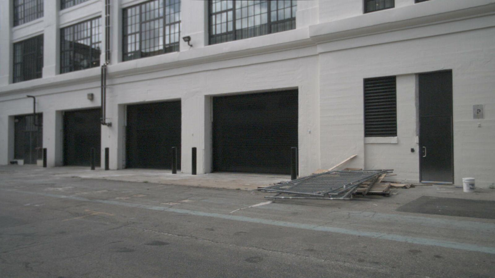</td>
</tr>
<tr>
<th style='text-align:center;padding:4px;font-size:12px;background:#111;color:#eee'>CAM_BACK</th>
<th style='text-align:center;padding:4px;font-size:12px;background:#111;color:#eee'>CAM_BACK_LEFT</th>
<th style='text-align:center;padding:4px;font-size:12px;background:#111;color:#eee'>CAM_BACK_RIGHT</th>
</tr>
<tr>
<td style='text-align:center;padding:4px;background:#000;'>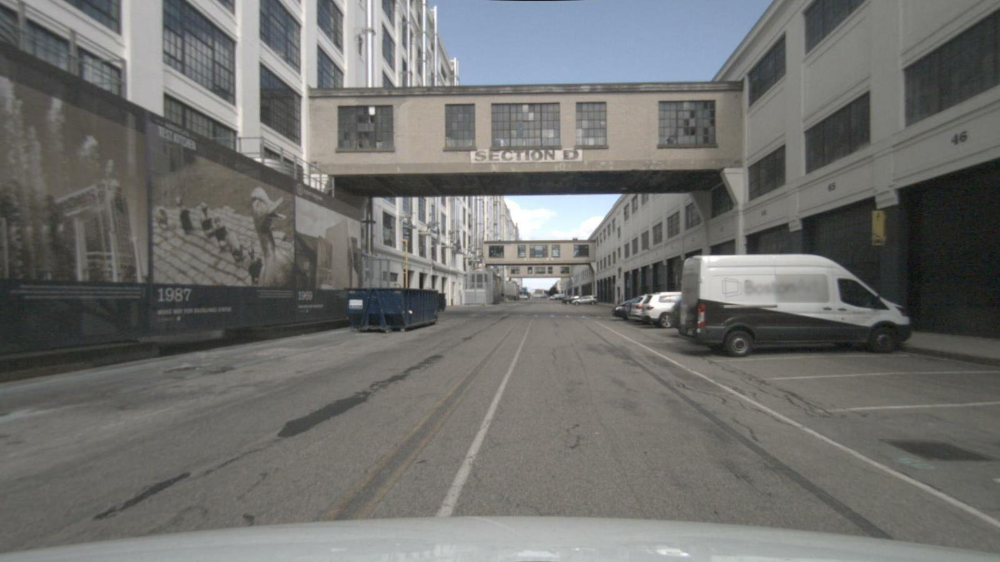</td>
<td style='text-align:center;padding:4px;background:#000;'>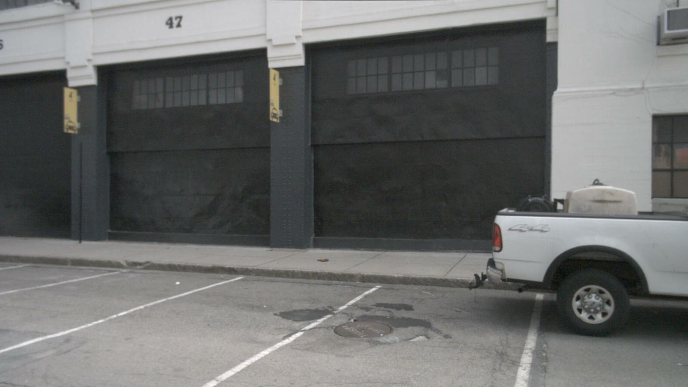</td>
<td style='text-align:center;padding:4px;background:#000;'>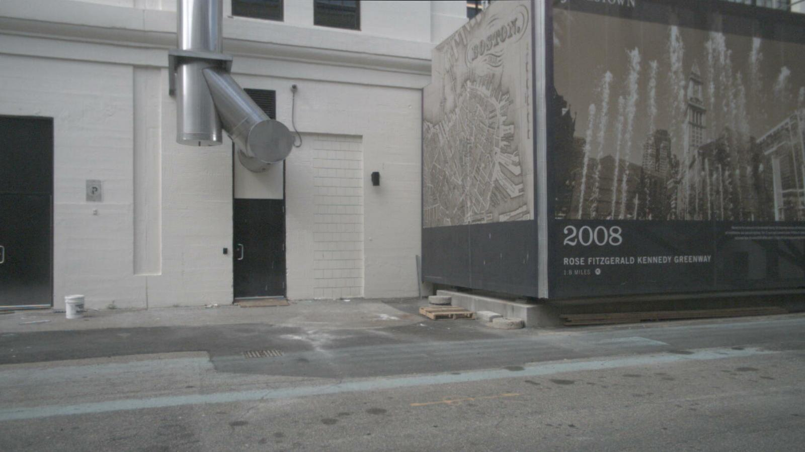</td>
</tr>
</table>

---

## Example idx=16815

**Q:** Question: What is the status of the cars that are to the front left of the ego car? Answer:
**Pred:** `Many cars are parked.`
**Gold:** `Many cars are parked.`

*Metrics:* ✅ **Exact match** | (EM=1, F1=1.000)

<table>
<tr>
<th style='text-align:center;padding:4px;font-size:12px;background:#111;color:#eee'>CAM_FRONT</th>
<th style='text-align:center;padding:4px;font-size:12px;background:#111;color:#eee'>CAM_FRONT_LEFT</th>
<th style='text-align:center;padding:4px;font-size:12px;background:#111;color:#eee'>CAM_FRONT_RIGHT</th>
</tr>
<tr>
<td style='text-align:center;padding:4px;background:#000;'>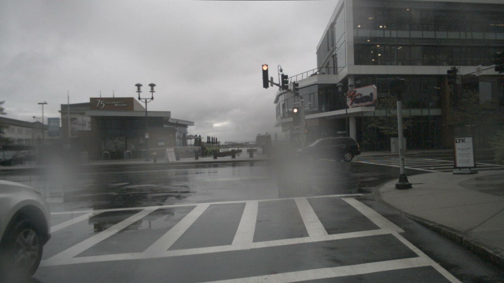</td>
<td style='text-align:center;padding:4px;background:#000;'>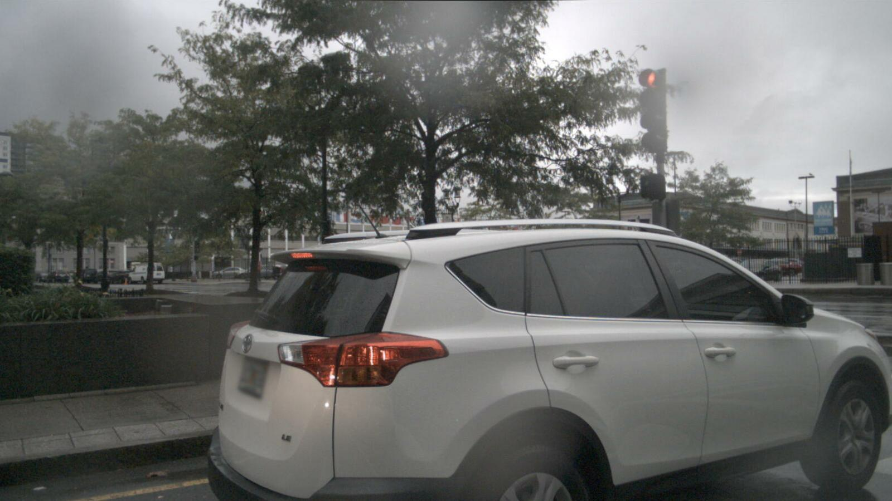</td>
<td style='text-align:center;padding:4px;background:#000;'>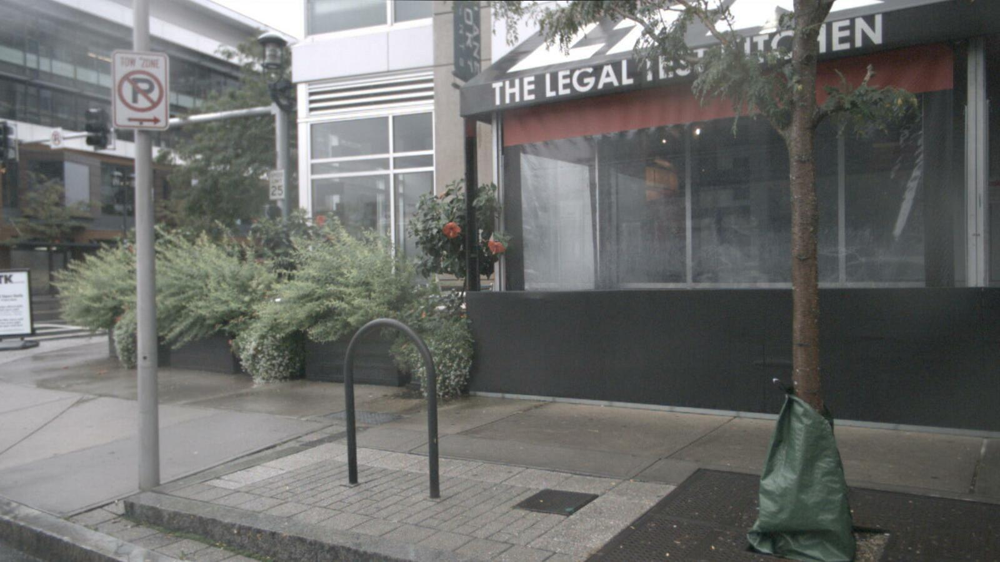</td>
</tr>
<tr>
<th style='text-align:center;padding:4px;font-size:12px;background:#111;color:#eee'>CAM_BACK</th>
<th style='text-align:center;padding:4px;font-size:12px;background:#111;color:#eee'>CAM_BACK_LEFT</th>
<th style='text-align:center;padding:4px;font-size:12px;background:#111;color:#eee'>CAM_BACK_RIGHT</th>
</tr>
<tr>
<td style='text-align:center;padding:4px;background:#000;'>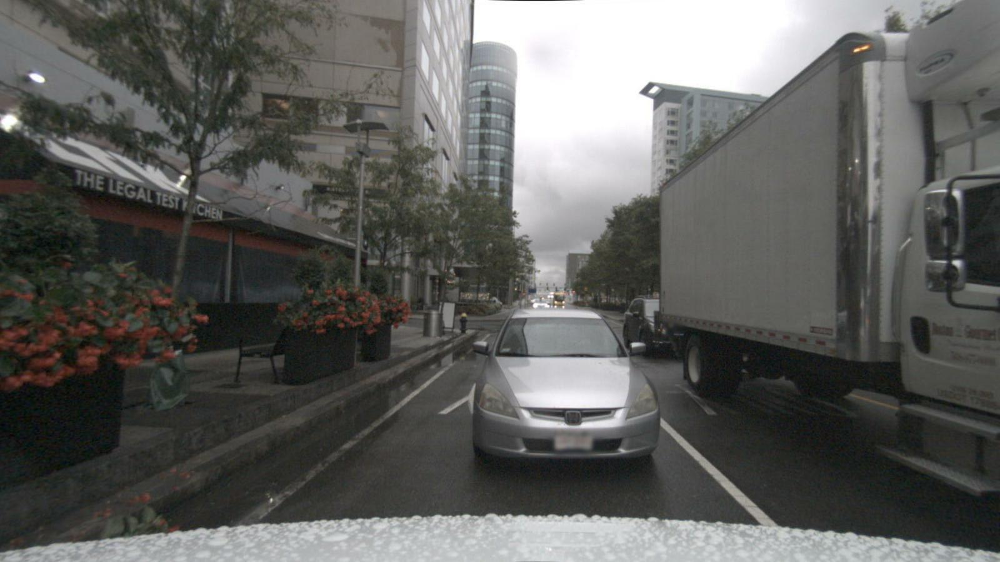</td>
<td style='text-align:center;padding:4px;background:#000;'>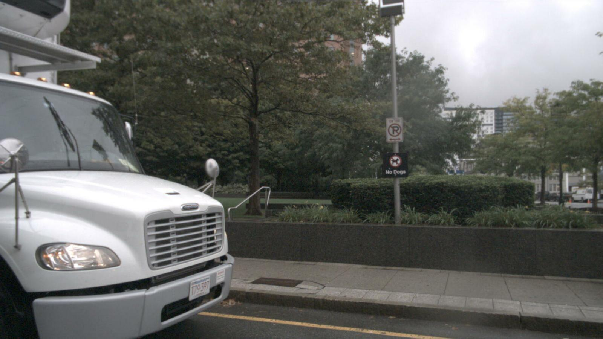</td>
<td style='text-align:center;padding:4px;background:#000;'>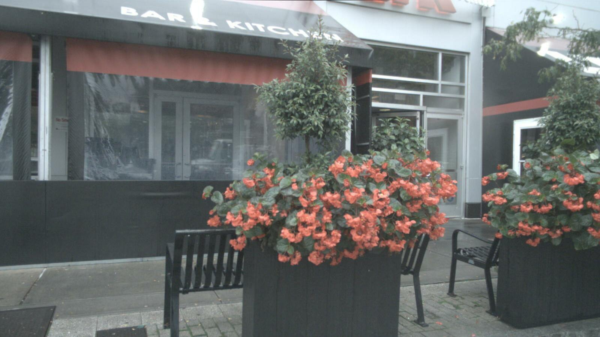</td>
</tr>
</table>

---

## Example idx=16814

**Q:** Question: Is it necessary for the ego vehicle to take <c3,CAM_FRONT,837.3,421.3> into account? Answer:
**Pred:** `Yes.`
**Gold:** `Yes.`

*Metrics:* ✅ **Exact match** | (EM=1, F1=1.000)

<table>
<tr>
<th style='text-align:center;padding:4px;font-size:12px;background:#111;color:#eee'>CAM_FRONT</th>
<th style='text-align:center;padding:4px;font-size:12px;background:#111;color:#eee'>CAM_FRONT_LEFT</th>
<th style='text-align:center;padding:4px;font-size:12px;background:#111;color:#eee'>CAM_FRONT_RIGHT</th>
</tr>
<tr>
<td style='text-align:center;padding:4px;background:#000;'>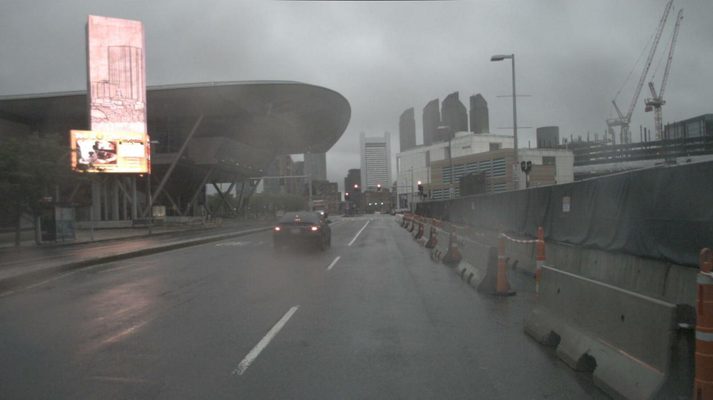</td>
<td style='text-align:center;padding:4px;background:#000;'>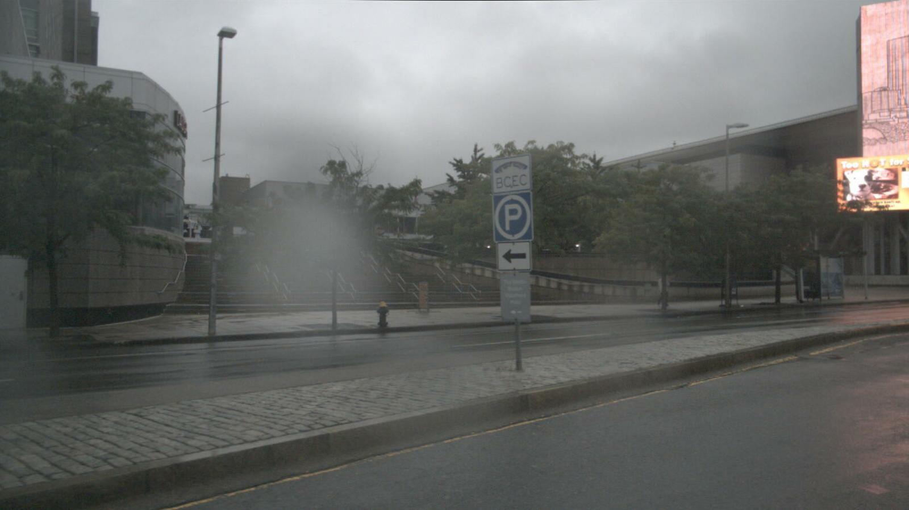</td>
<td style='text-align:center;padding:4px;background:#000;'>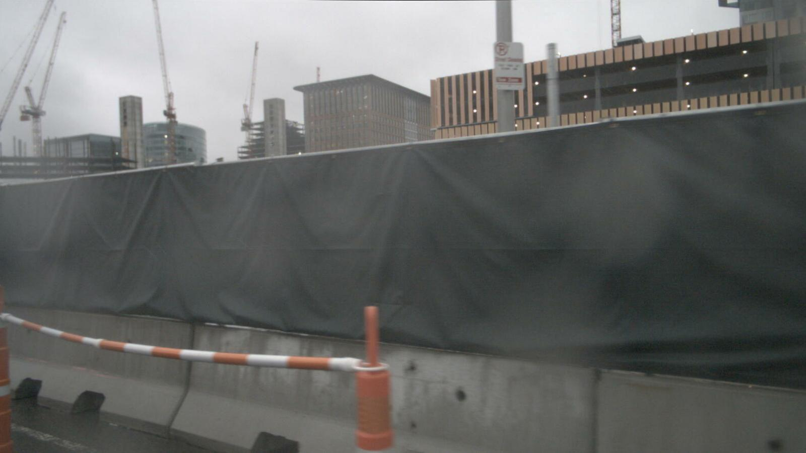</td>
</tr>
<tr>
<th style='text-align:center;padding:4px;font-size:12px;background:#111;color:#eee'>CAM_BACK</th>
<th style='text-align:center;padding:4px;font-size:12px;background:#111;color:#eee'>CAM_BACK_LEFT</th>
<th style='text-align:center;padding:4px;font-size:12px;background:#111;color:#eee'>CAM_BACK_RIGHT</th>
</tr>
<tr>
<td style='text-align:center;padding:4px;background:#000;'>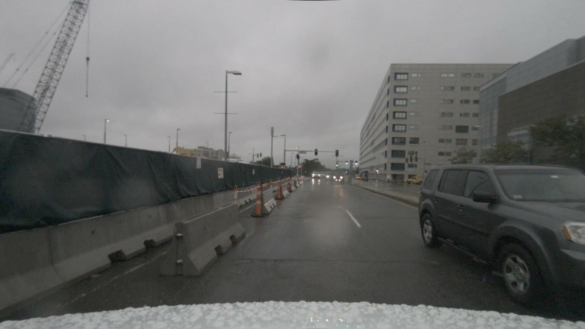</td>
<td style='text-align:center;padding:4px;background:#000;'>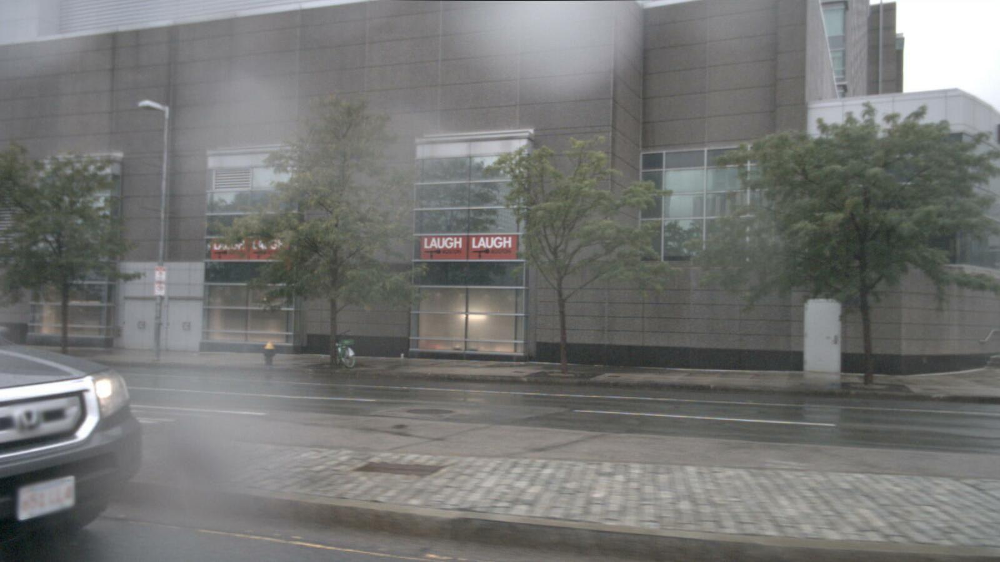</td>
<td style='text-align:center;padding:4px;background:#000;'>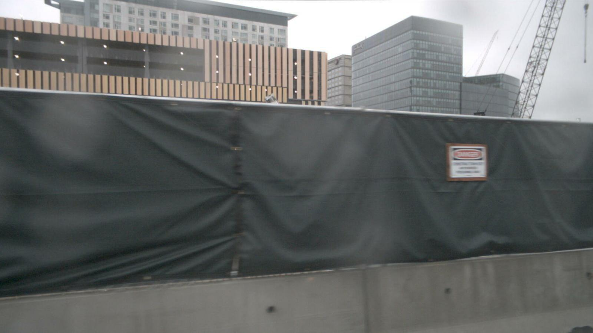</td>
</tr>
</table>

---

## Example idx=16812

**Q:** Question: What is the moving status of object <c2,CAM_FRONT_RIGHT,801.7,529.2>? Answer:
**Pred:** `Going ahead.`
**Gold:** `Going ahead.`

*Metrics:* ✅ **Exact match** | (EM=1, F1=1.000)

<table>
<tr>
<th style='text-align:center;padding:4px;font-size:12px;background:#111;color:#eee'>CAM_FRONT</th>
<th style='text-align:center;padding:4px;font-size:12px;background:#111;color:#eee'>CAM_FRONT_LEFT</th>
<th style='text-align:center;padding:4px;font-size:12px;background:#111;color:#eee'>CAM_FRONT_RIGHT</th>
</tr>
<tr>
<td style='text-align:center;padding:4px;background:#000;'>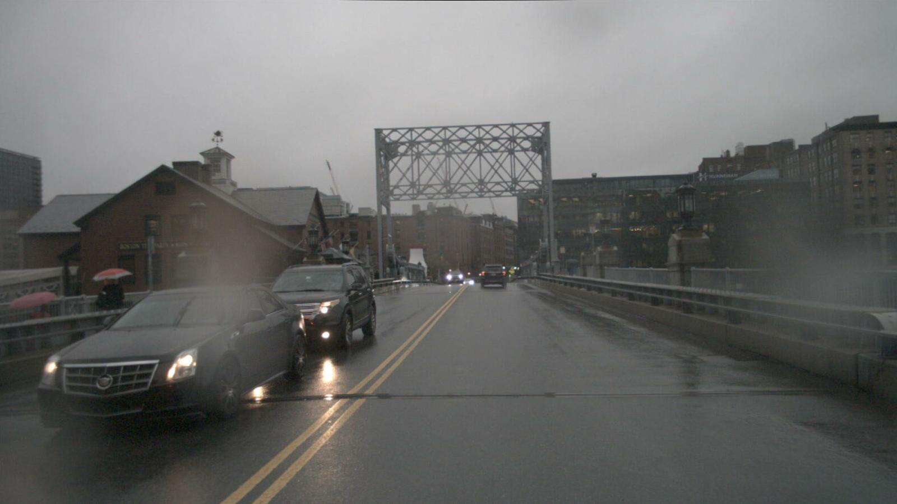</td>
<td style='text-align:center;padding:4px;background:#000;'>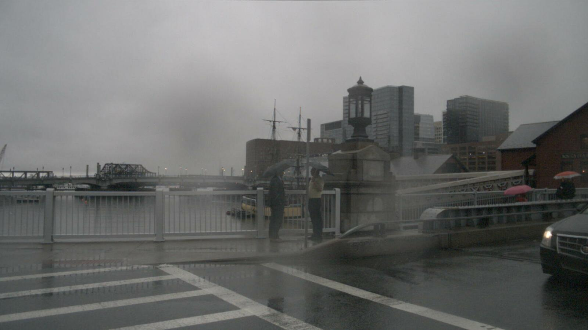</td>
<td style='text-align:center;padding:4px;background:#000;'>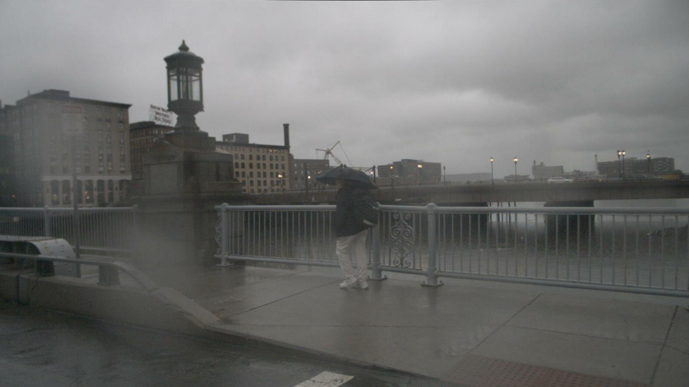</td>
</tr>
<tr>
<th style='text-align:center;padding:4px;font-size:12px;background:#111;color:#eee'>CAM_BACK</th>
<th style='text-align:center;padding:4px;font-size:12px;background:#111;color:#eee'>CAM_BACK_LEFT</th>
<th style='text-align:center;padding:4px;font-size:12px;background:#111;color:#eee'>CAM_BACK_RIGHT</th>
</tr>
<tr>
<td style='text-align:center;padding:4px;background:#000;'>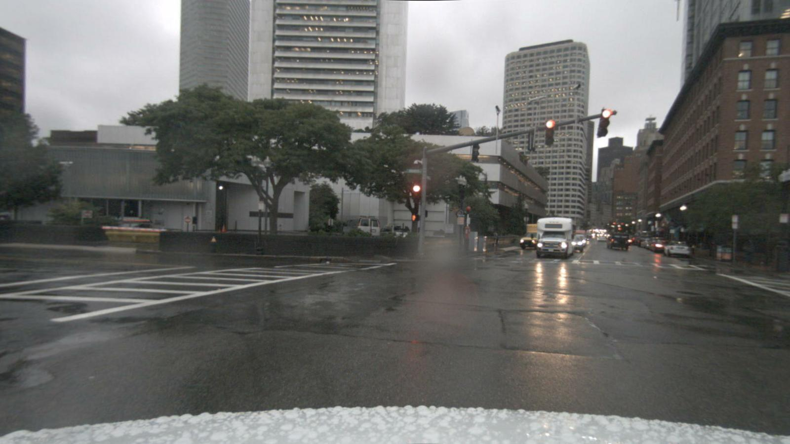</td>
<td style='text-align:center;padding:4px;background:#000;'>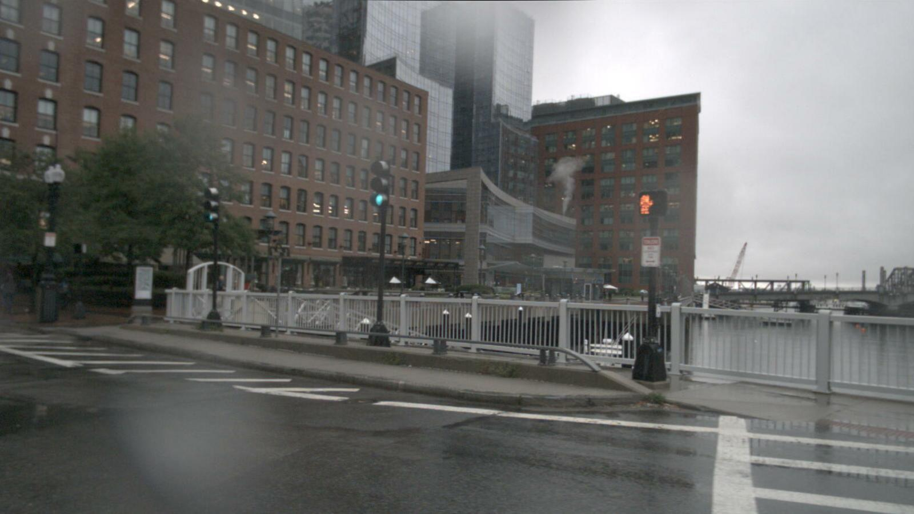</td>
<td style='text-align:center;padding:4px;background:#000;'>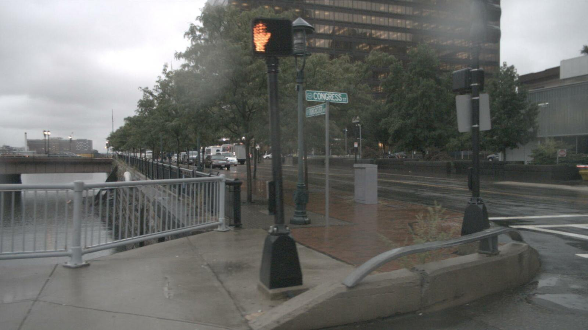</td>
</tr>
</table>

---

## Example idx=16811

**Q:** Question: What is the status of the bicycle that is to the back of the ego car? Answer:
**Pred:** `One bicycle is without a rider.`
**Gold:** `One bicycle is without a rider.`

*Metrics:* ✅ **Exact match** | (EM=1, F1=1.000)

<table>
<tr>
<th style='text-align:center;padding:4px;font-size:12px;background:#111;color:#eee'>CAM_FRONT</th>
<th style='text-align:center;padding:4px;font-size:12px;background:#111;color:#eee'>CAM_FRONT_LEFT</th>
<th style='text-align:center;padding:4px;font-size:12px;background:#111;color:#eee'>CAM_FRONT_RIGHT</th>
</tr>
<tr>
<td style='text-align:center;padding:4px;background:#000;'>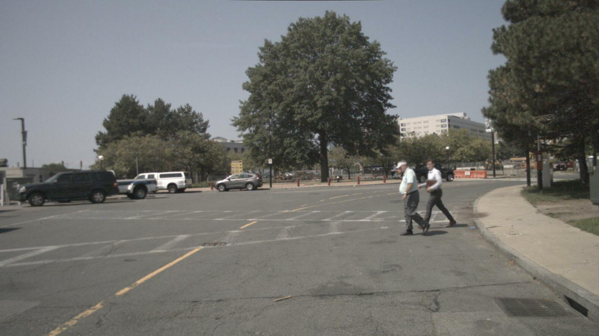</td>
<td style='text-align:center;padding:4px;background:#000;'>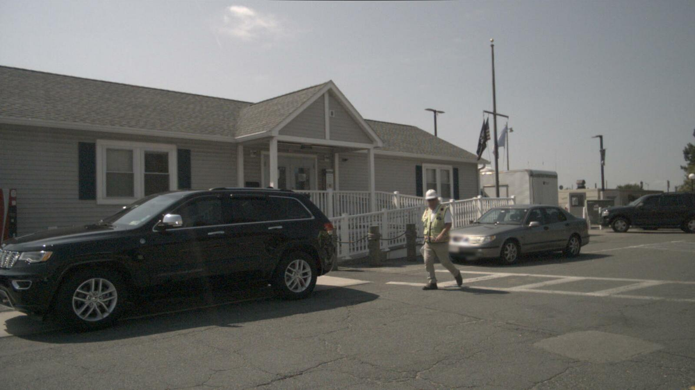</td>
<td style='text-align:center;padding:4px;background:#000;'>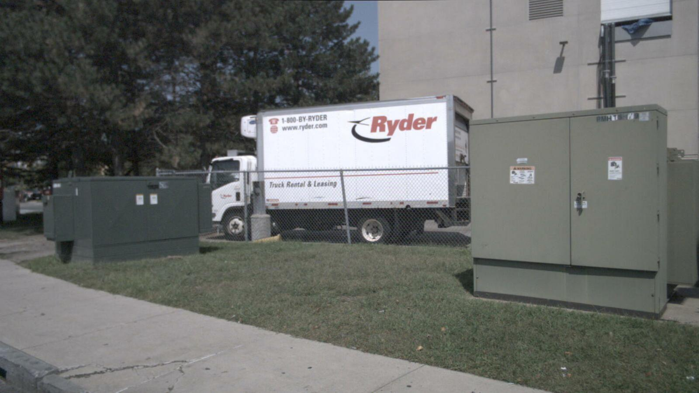</td>
</tr>
<tr>
<th style='text-align:center;padding:4px;font-size:12px;background:#111;color:#eee'>CAM_BACK</th>
<th style='text-align:center;padding:4px;font-size:12px;background:#111;color:#eee'>CAM_BACK_LEFT</th>
<th style='text-align:center;padding:4px;font-size:12px;background:#111;color:#eee'>CAM_BACK_RIGHT</th>
</tr>
<tr>
<td style='text-align:center;padding:4px;background:#000;'>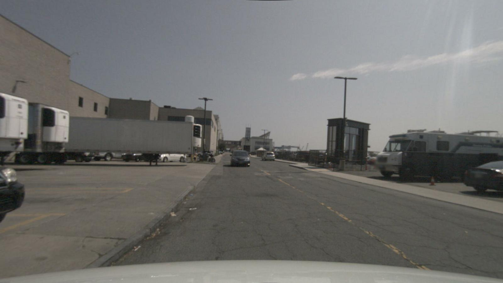</td>
<td style='text-align:center;padding:4px;background:#000;'></td>
<td style='text-align:center;padding:4px;background:#000;'>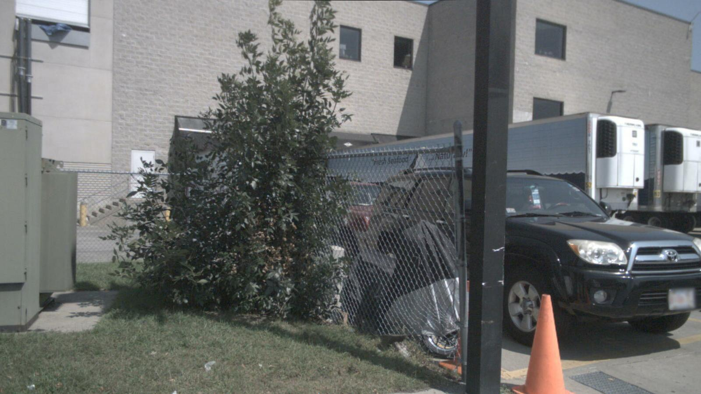</td>
</tr>
</table>

---

# Bottom 5 examples by F1

## Example idx=13

**Q:** Question: What is the traffic signal that the ego vehicle should pay attention to? Answer:
**Pred:** `None.`
**Gold:** `Red light.`

*Metrics:* 🔴 **Low match** | (EM=0, F1=0.000)

<table>
<tr>
<th style='text-align:center;padding:4px;font-size:12px;background:#111;color:#eee'>CAM_FRONT</th>
<th style='text-align:center;padding:4px;font-size:12px;background:#111;color:#eee'>CAM_FRONT_LEFT</th>
<th style='text-align:center;padding:4px;font-size:12px;background:#111;color:#eee'>CAM_FRONT_RIGHT</th>
</tr>
<tr>
<td style='text-align:center;padding:4px;background:#000;'></td>
<td style='text-align:center;padding:4px;background:#000;'></td>
<td style='text-align:center;padding:4px;background:#000;'></td>
</tr>
<tr>
<th style='text-align:center;padding:4px;font-size:12px;background:#111;color:#eee'>CAM_BACK</th>
<th style='text-align:center;padding:4px;font-size:12px;background:#111;color:#eee'>CAM_BACK_LEFT</th>
<th style='text-align:center;padding:4px;font-size:12px;background:#111;color:#eee'>CAM_BACK_RIGHT</th>
</tr>
<tr>
<td style='text-align:center;padding:4px;background:#000;'></td>
<td style='text-align:center;padding:4px;background:#000;'></td>
<td style='text-align:center;padding:4px;background:#000;'></td>
</tr>
</table>

---

## Example idx=18

**Q:** Question: Is <c3,CAM_BACK_LEFT,91.8,645.9> a traffic sign or a road barrier? Answer:
**Pred:** `No.`
**Gold:** `Yes.`

*Metrics:* 🔴 **Low match** | (EM=0, F1=0.000)

<table>
<tr>
<th style='text-align:center;padding:4px;font-size:12px;background:#111;color:#eee'>CAM_FRONT</th>
<th style='text-align:center;padding:4px;font-size:12px;background:#111;color:#eee'>CAM_FRONT_LEFT</th>
<th style='text-align:center;padding:4px;font-size:12px;background:#111;color:#eee'>CAM_FRONT_RIGHT</th>
</tr>
<tr>
<td style='text-align:center;padding:4px;background:#000;'>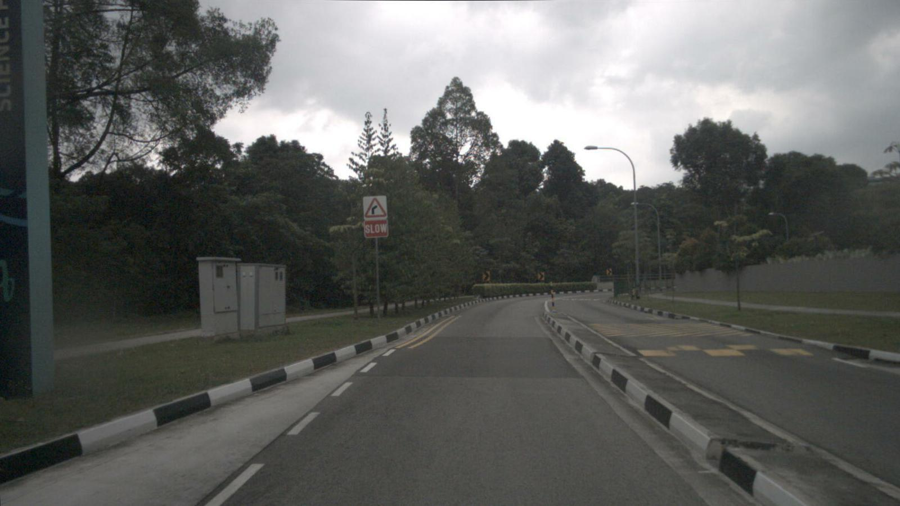</td>
<td style='text-align:center;padding:4px;background:#000;'>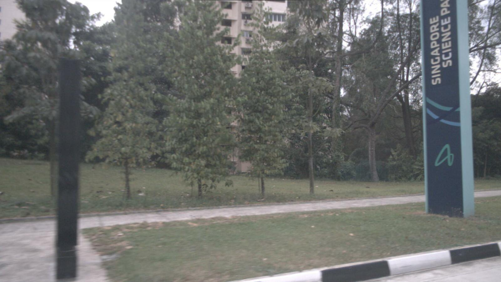</td>
<td style='text-align:center;padding:4px;background:#000;'>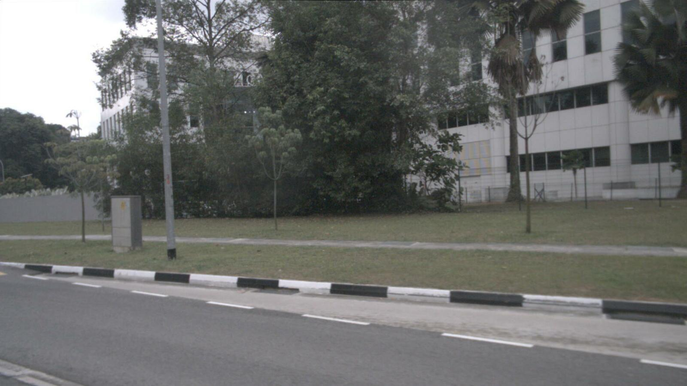</td>
</tr>
<tr>
<th style='text-align:center;padding:4px;font-size:12px;background:#111;color:#eee'>CAM_BACK</th>
<th style='text-align:center;padding:4px;font-size:12px;background:#111;color:#eee'>CAM_BACK_LEFT</th>
<th style='text-align:center;padding:4px;font-size:12px;background:#111;color:#eee'>CAM_BACK_RIGHT</th>
</tr>
<tr>
<td style='text-align:center;padding:4px;background:#000;'>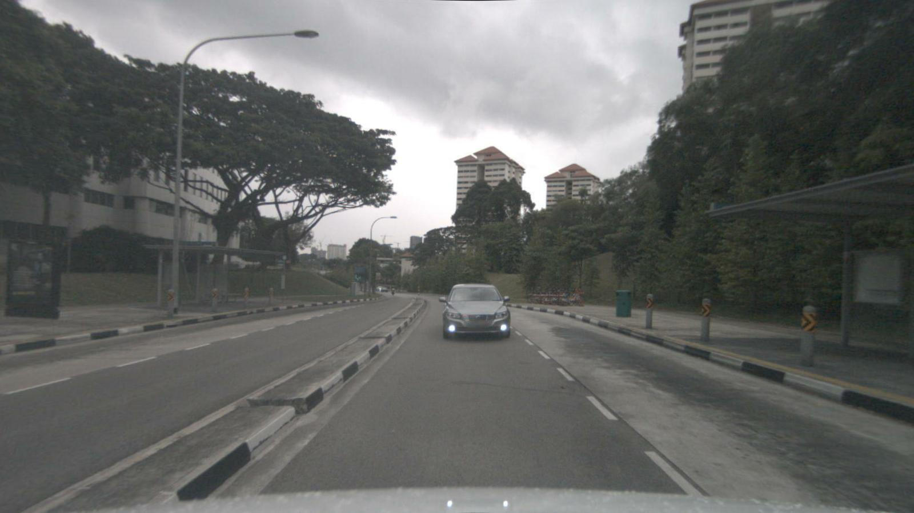</td>
<td style='text-align:center;padding:4px;background:#000;'>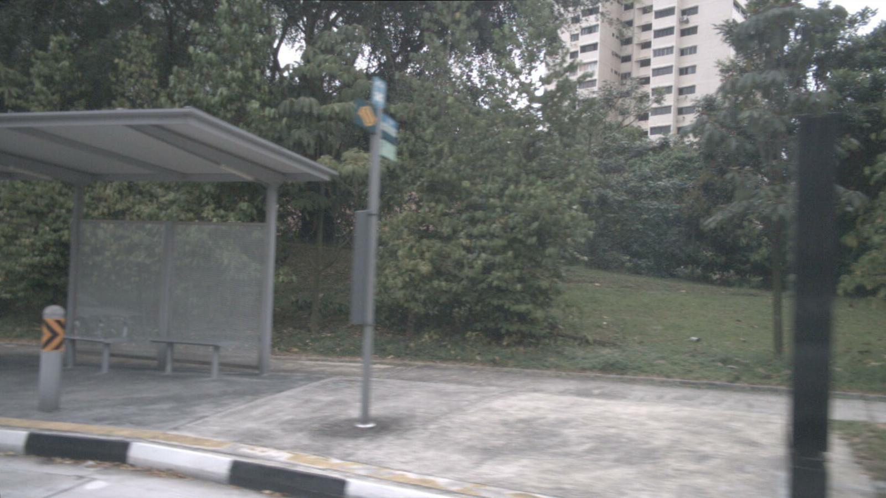</td>
<td style='text-align:center;padding:4px;background:#000;'>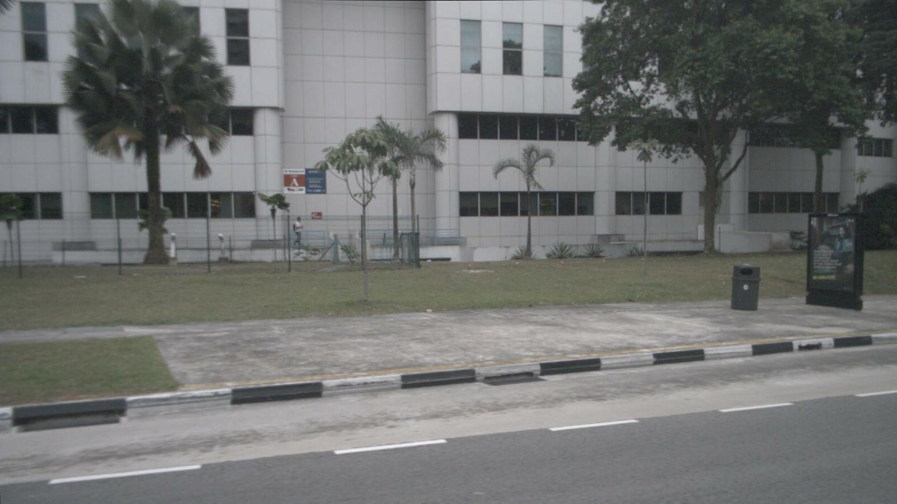</td>
</tr>
</table>

---

## Example idx=28

**Q:** Question: What is the priority of the objects that the ego vehicle should consider?(in descending order) Answer:
**Pred:** `< c1,CAM_FRONT_RIGHT,1128.3,510.0>, < c2,CAM_FRONT,840.0,500.0>, < c3,CAM_FRONT,840.0,500.0>.`
**Gold:** `< c1,CAM_FRONT,39.2,440.0>, < c3,CAM_FRONT,250.8,418.3>, < c2,CAM_BACK,1009.2,655.0>.`

*Metrics:* 🔴 **Low match** | (EM=0, F1=0.000)

<table>
<tr>
<th style='text-align:center;padding:4px;font-size:12px;background:#111;color:#eee'>CAM_FRONT</th>
<th style='text-align:center;padding:4px;font-size:12px;background:#111;color:#eee'>CAM_FRONT_LEFT</th>
<th style='text-align:center;padding:4px;font-size:12px;background:#111;color:#eee'>CAM_FRONT_RIGHT</th>
</tr>
<tr>
<td style='text-align:center;padding:4px;background:#000;'>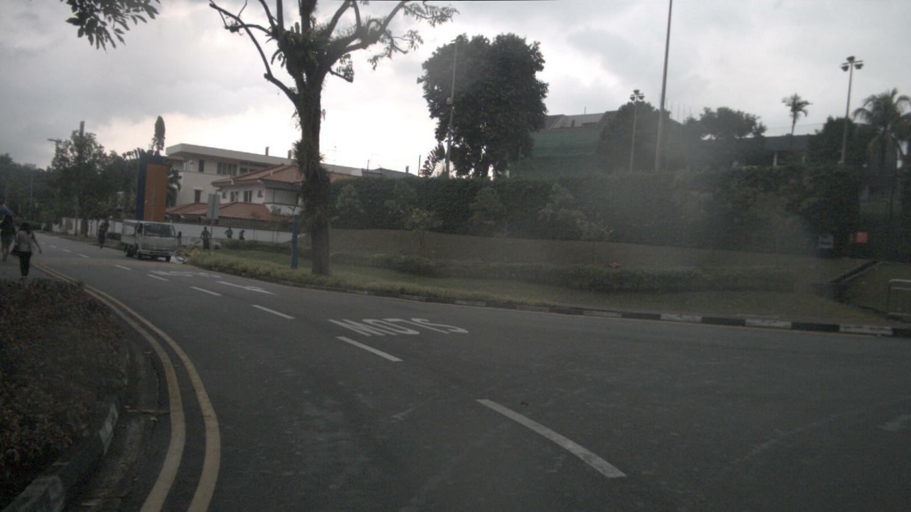</td>
<td style='text-align:center;padding:4px;background:#000;'>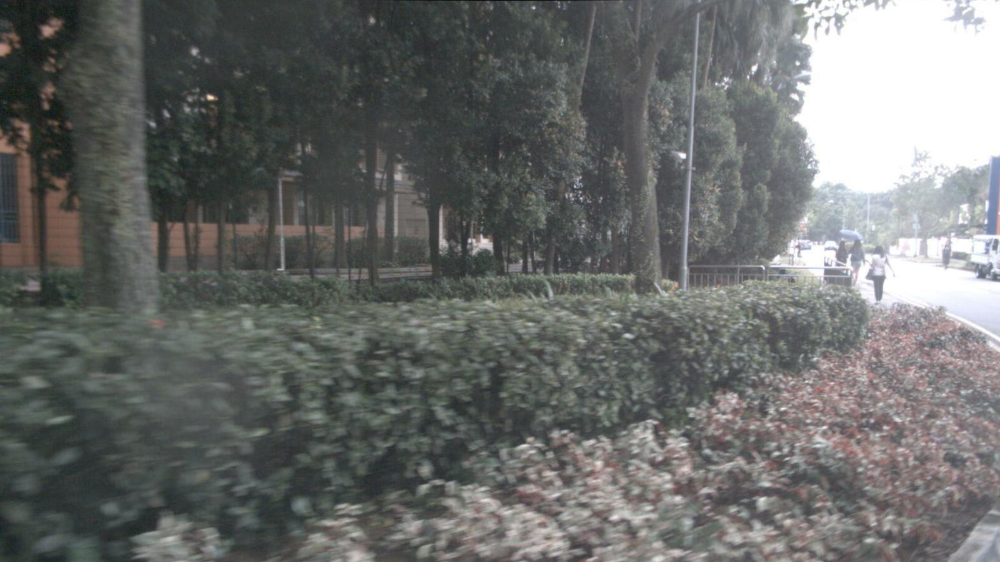</td>
<td style='text-align:center;padding:4px;background:#000;'>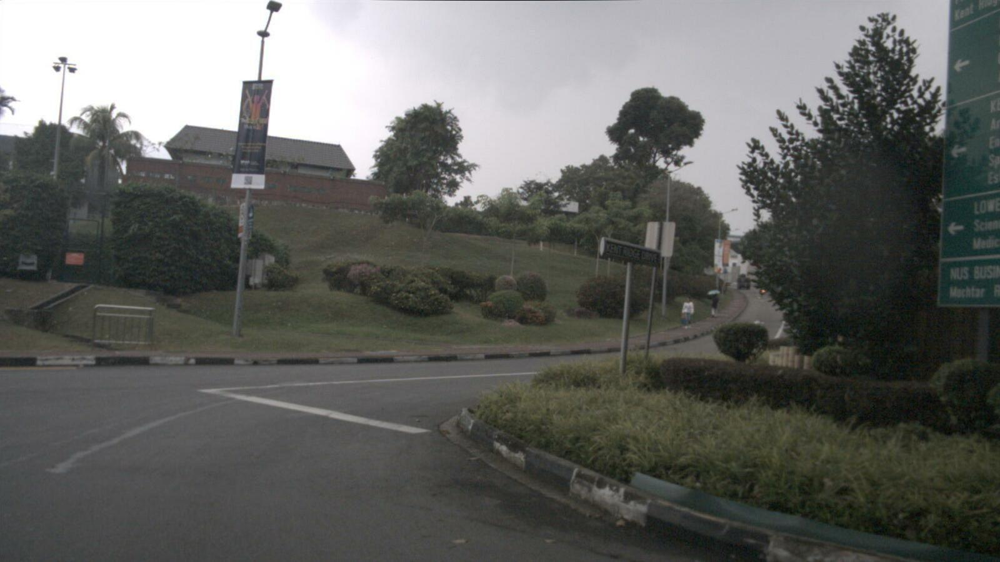</td>
</tr>
<tr>
<th style='text-align:center;padding:4px;font-size:12px;background:#111;color:#eee'>CAM_BACK</th>
<th style='text-align:center;padding:4px;font-size:12px;background:#111;color:#eee'>CAM_BACK_LEFT</th>
<th style='text-align:center;padding:4px;font-size:12px;background:#111;color:#eee'>CAM_BACK_RIGHT</th>
</tr>
<tr>
<td style='text-align:center;padding:4px;background:#000;'>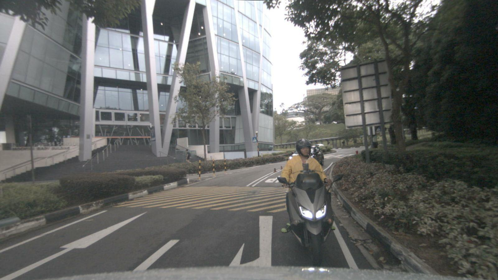</td>
<td style='text-align:center;padding:4px;background:#000;'>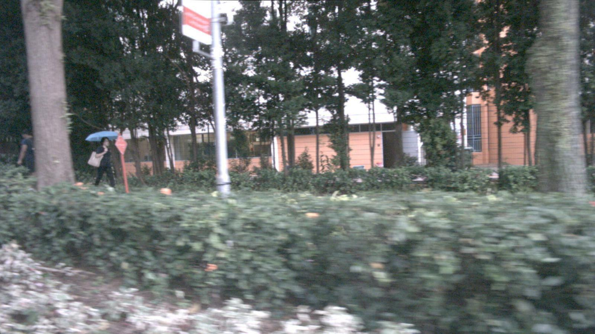</td>
<td style='text-align:center;padding:4px;background:#000;'>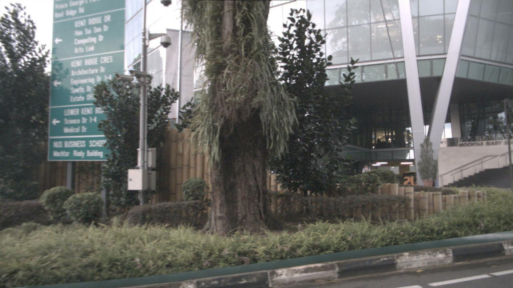</td>
</tr>
</table>

---

## Example idx=31

**Q:** Question: What actions taken by the ego vehicle can lead to a collision with <c1,CAM_BACK,880.0,498.3>? Answer:
**Pred:** `Brake suddenly.`
**Gold:** `Back up.`

*Metrics:* 🔴 **Low match** | (EM=0, F1=0.000)

<table>
<tr>
<th style='text-align:center;padding:4px;font-size:12px;background:#111;color:#eee'>CAM_FRONT</th>
<th style='text-align:center;padding:4px;font-size:12px;background:#111;color:#eee'>CAM_FRONT_LEFT</th>
<th style='text-align:center;padding:4px;font-size:12px;background:#111;color:#eee'>CAM_FRONT_RIGHT</th>
</tr>
<tr>
<td style='text-align:center;padding:4px;background:#000;'>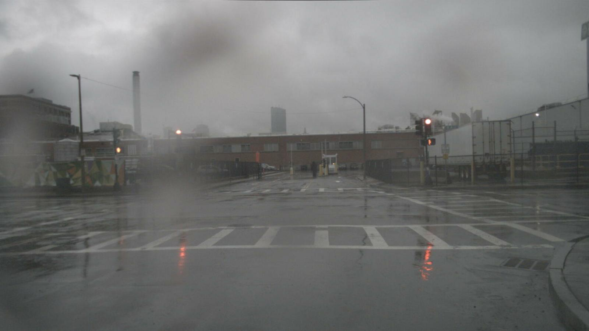</td>
<td style='text-align:center;padding:4px;background:#000;'>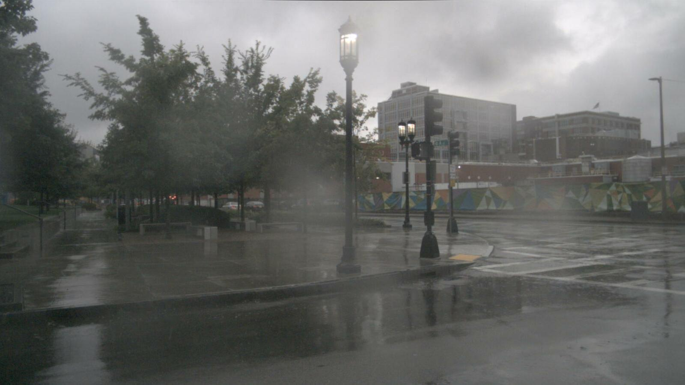</td>
<td style='text-align:center;padding:4px;background:#000;'>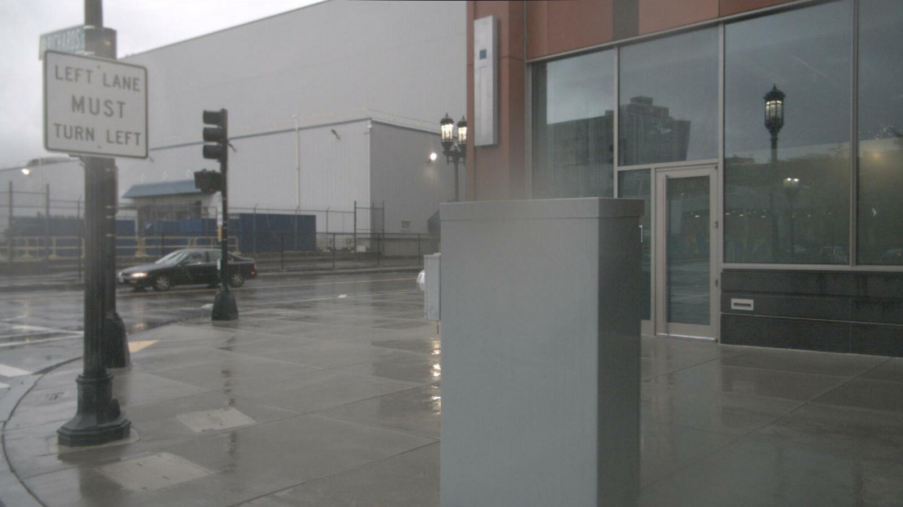</td>
</tr>
<tr>
<th style='text-align:center;padding:4px;font-size:12px;background:#111;color:#eee'>CAM_BACK</th>
<th style='text-align:center;padding:4px;font-size:12px;background:#111;color:#eee'>CAM_BACK_LEFT</th>
<th style='text-align:center;padding:4px;font-size:12px;background:#111;color:#eee'>CAM_BACK_RIGHT</th>
</tr>
<tr>
<td style='text-align:center;padding:4px;background:#000;'>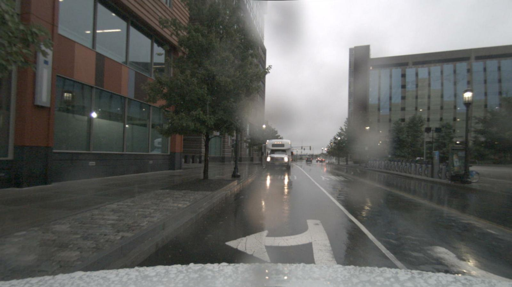</td>
<td style='text-align:center;padding:4px;background:#000;'></td>
<td style='text-align:center;padding:4px;background:#000;'>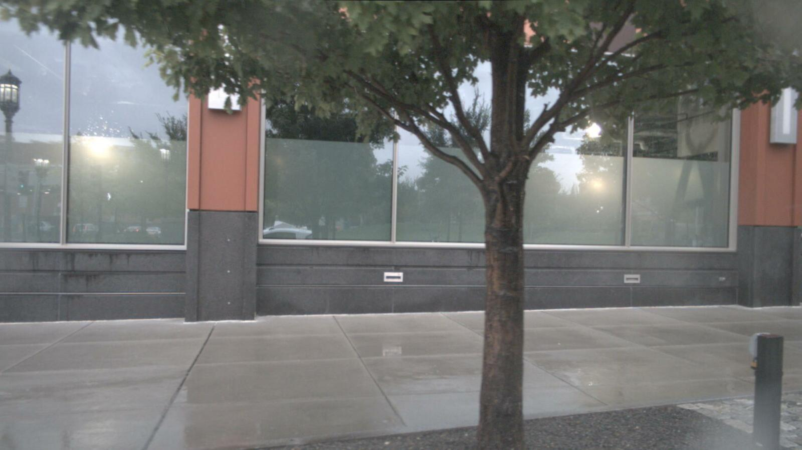</td>
</tr>
</table>

---

## Example idx=34

**Q:** Question: Would <c3,CAM_FRONT,1155.4,528.6> be in the moving direction of the ego vehicle? Answer:
**Pred:** `No.`
**Gold:** `Yes.`

*Metrics:* 🔴 **Low match** | (EM=0, F1=0.000)

<table>
<tr>
<th style='text-align:center;padding:4px;font-size:12px;background:#111;color:#eee'>CAM_FRONT</th>
<th style='text-align:center;padding:4px;font-size:12px;background:#111;color:#eee'>CAM_FRONT_LEFT</th>
<th style='text-align:center;padding:4px;font-size:12px;background:#111;color:#eee'>CAM_FRONT_RIGHT</th>
</tr>
<tr>
<td style='text-align:center;padding:4px;background:#000;'>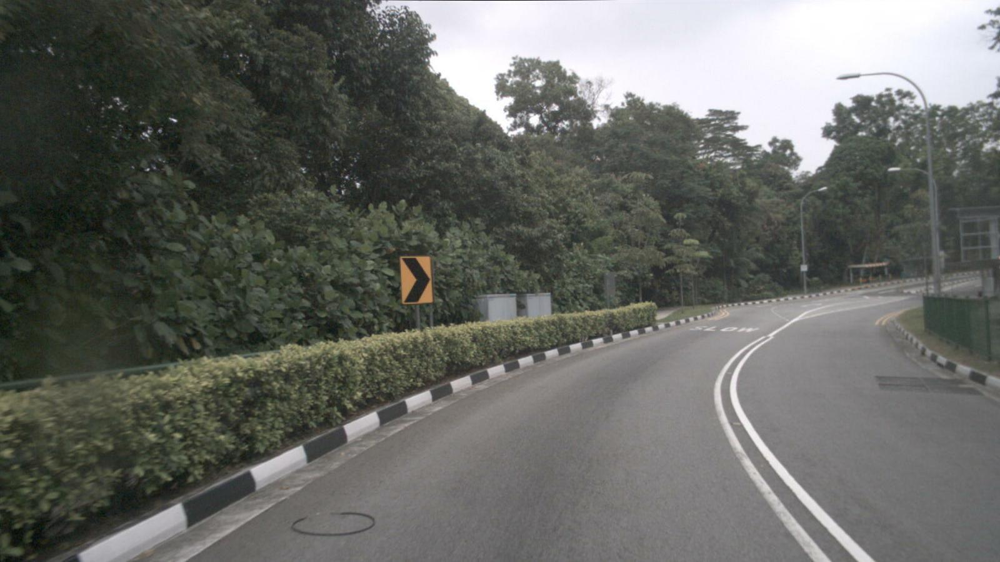</td>
<td style='text-align:center;padding:4px;background:#000;'>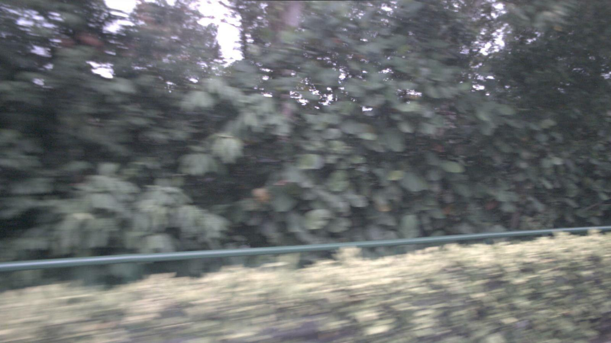</td>
<td style='text-align:center;padding:4px;background:#000;'>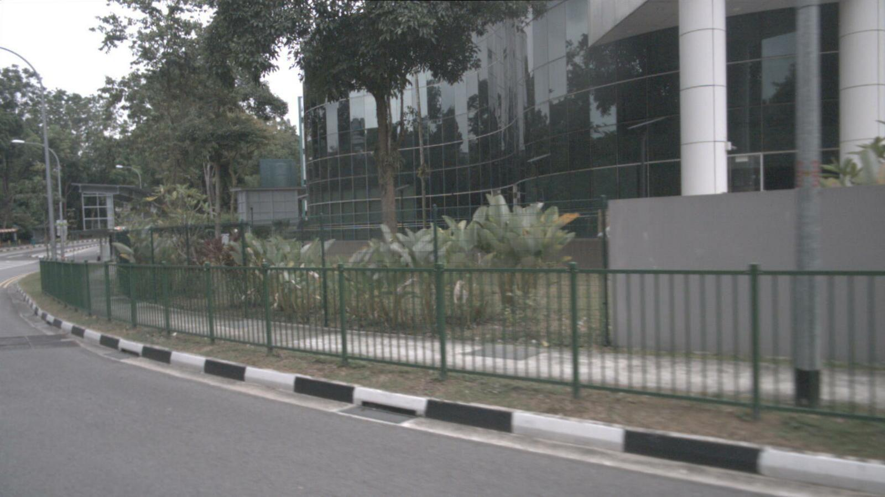</td>
</tr>
<tr>
<th style='text-align:center;padding:4px;font-size:12px;background:#111;color:#eee'>CAM_BACK</th>
<th style='text-align:center;padding:4px;font-size:12px;background:#111;color:#eee'>CAM_BACK_LEFT</th>
<th style='text-align:center;padding:4px;font-size:12px;background:#111;color:#eee'>CAM_BACK_RIGHT</th>
</tr>
<tr>
<td style='text-align:center;padding:4px;background:#000;'>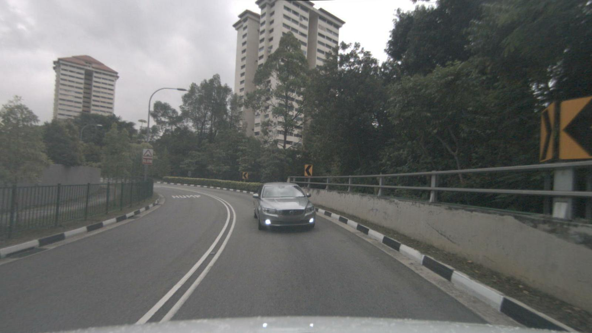</td>
<td style='text-align:center;padding:4px;background:#000;'>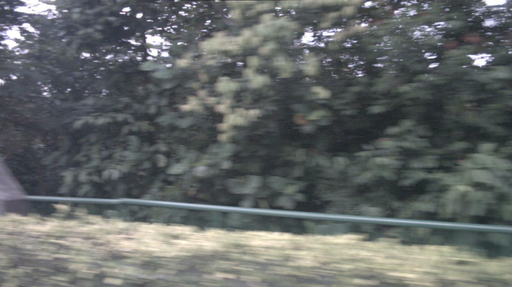</td>
<td style='text-align:center;padding:4px;background:#000;'>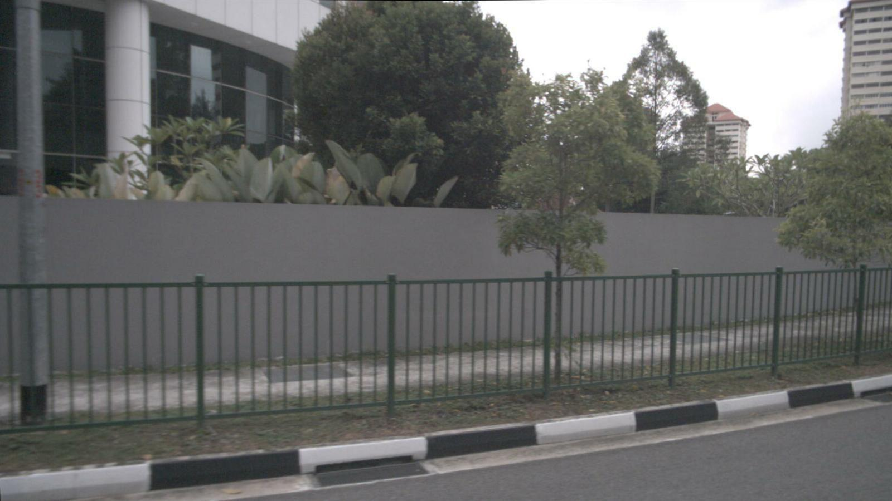</td>
</tr>
</table>

---
